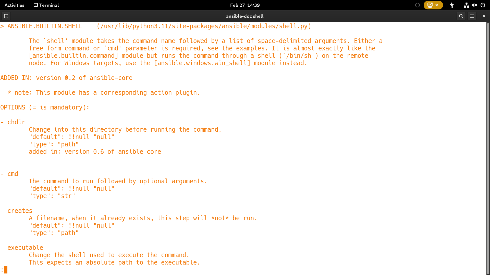
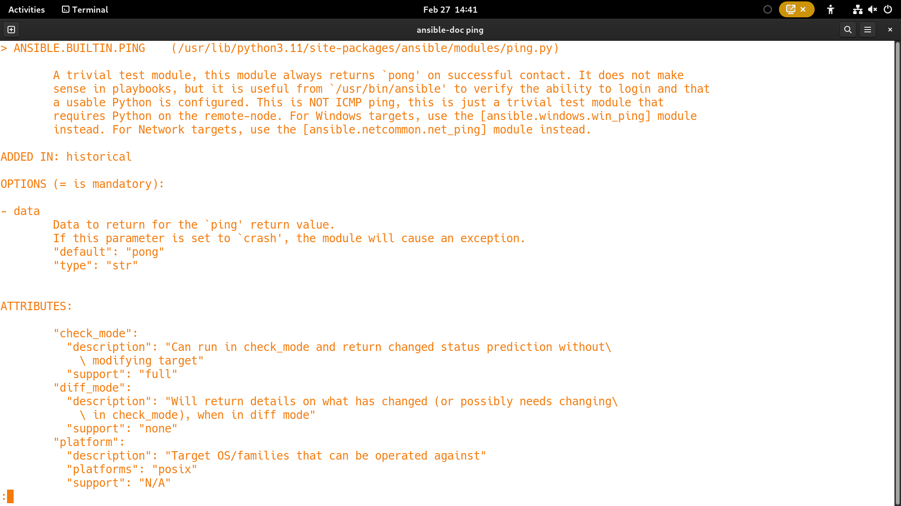
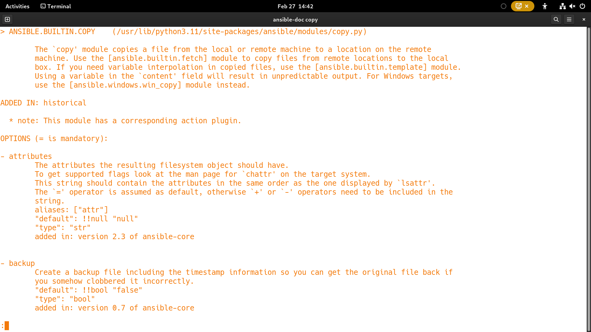

# Day 1

## What is Configuration Management Tool?
- are used to automate software installation and configuration
- in most cases, software installation automation is done on a already provisioned machine
- Examples
  - Puppet
  - Chef
  - Salt/SaltStack
  - Ansible
- Idempotent

## Puppet/Chef
- follows client/Server architecture
- Puppet/Chef Agent
  - special proprietary softwares that has to installed on the servers where the software installation/configuration automation must be performed
- Chef uses a proprietary tool called knife to push/copy the automation script (recipe) to the Chef Agent
- the language in which the automation code is written that is referred as DSL(Domain Specific Language)
- DSL used is Ruby
- advantages
  - can handle any complex software installation/configuration management 
- disadvantages
  - wrong choice of DSL, hence learning curve for Chef/Puppet is steep
  - installation is also complex
  - follows PULL based architecture

## Ansible
- developed by Michael Deehan in Python ( a former Red Hat employee )
- agentless
  - doesn't require any special proprietary software on the ansible nodes where software installation automation must be done
- doesn't follow client/server architecture
- DSL used in Ansible is YAML (Yet Another Markup Language - Superset of JSON)
- follows simple architecture
  - uses existing tools to achieve the software installation/configuration management
- Ansible Modules
  - Ansible uses ansible modules to perform the automation
  - Ansible modules supported for Unix/Linux/Mac Ansible nodes are Python scripts
  - Ansible modules supported for Windows Ansible nodes are PowerShell scripts
  - Examples
    - copy module helps copying files from local machine to the Ansible node or vice versa
    - shell module helps running shell commands on the Unix/Linux/Mac Ansible nodes
    - service to manage services in Unix/Linux/Mac
    - apt module helps in software installation/uninstallation/ugrade on Debain based ansible nodes
    - yum module helps in software installation/uninstallation/upgrade on Red Hat OS family
- Ansible comes 3 flavors
  1. Ansible Core 
     - opensource
     - supports only CLI
  2. AWX
     - opensource
     - this is developed on top of Ansible Core
     - supports Webconsole (GUI)
     - no support from Red Hat
     - user management
     - you can see the history of playbook execution and its logs
  3. Red Hat Ansible Tower
     - Enterprise Product from Red Hat
     - this is developed on top of AWX
     - supports Webconsole (GUI)
     - you get support from Red Hat
     - user management
     - you can see the history of playbook execution and its logs

## Ansible High-Level Architecture


## What is Hypervisor?
- Virtualization Technology
- Processors
  Intel
  - Virtualization feature is called VT-X
  
  AMD
  - Virtualization feature is called AMD-V
  
- The OS on which the Virtualization software is installed is called Host OS
- The OS installed within the Virtual Machine is called Guest OS
- There are 2 types 
  1. Type1 - used in Servers/Workstation - this doesn't require a OS - can be installed on bare-metal
     - VMWare vCenter/vSphere
  2. Type2 - used in Laptops/Desktops/Workstation - this requires a Host OS ( Windows, Linux, Mac )
     - VMWare Workstation
     - KVM
     - Parallels
     - Oracle VirtualBox
     - Microsoft Hyper-V
- for each Guest OS, we need to allocate dedicated
  - CPU Cores
  - RAM and
  - Storage
- hence, this type of Virtualization is called Heave-weight Virtualization
- allowed consolidation of many physical servers into few/some physical servers
- Servers will have multiple Processor Socket
- Processors comes in different form factor/packaging
- each Virtual Machine represents one fully function Operating System that has 
   - OS Kernel
   - dedicated Hardware resources ( CPU, RAM, Storage, Network & Graphics Cards, etc.,)
   
  1. SCM (Single Chip Module)
     - One IC will have just one Processor
  2. MCM (Multiple Chip Module)
     - One IC will have many Processors
    
- each Processors might have many CPU Cores
- There are Server motherboard with 8 Sockets 
   - If each Socket supports MCM with let's 4 Processor's, 4 x 8 Sockets = 32 Processors
   - If each Processor supports 128 Cores, then 32 Processors x 128 Cores = 4096 Physical Cores
   - HyperThreading technology supports running 2 or more threads parallely in each Physical core
   - each Physical core is seen by the OS/Virtualization software as 2 virtual cores
   - modern server grade Processors supports upto 4 virtual cores per Physical Processor
   - 4096 Physical cores x 2 = 8192 virtual Cores

## What is Docker?
- is an application virtualization technology
- Docker containers represent one single application
- container is an application process
- it is not an Operating System
- they don't have their own OS Kernel
- they don't have their own dedicated Hardware resources
- containers shares the OS Kernel from the underlying Host OS
- containers shares the hardware resources available on the Host OS
- that is why they are called lightweight virtualization technology
- easily we can create 30~40 containers in a normal laptop/desktop

## What is the technology that enables Containerization?
- containerization is a Linux technology
- Linux Kernels supports
  1. Namespace
     - allows to isolate one container from the other containers
  2. Control Groups (CGroups)
     - allows to apply resource quota restrictions on individual containers
     - example
       - we can restrict how many cpu cores at max a container can utilize
       - we can restrict the max amount of RAM a container can use
       - can restrict the max storage capacity
- Docker is supported in Linux/Unix/Mac/Windows
- When we install Docker for Windows/Mac, it installs a thin linux layer(Linux kernel), which means the linux application containers continues to run on Linux even on Windows/Mac machines.
- Microsoft OS Kernel can't be separated from the OS, it is not modular, OS Kernel and the OS itself is strongly coupled, hence we can't separate out the Microsoft OS Kernel alone
- It is for this reason, Linux doesn't support running a .Net application containers on Unix/Linux/Mac.

## Hypervisor vs Docker High Level Architecure


# Ansible Commands

## Finding the ansible version
```
ansible --version
```
Expected output
<pre>
 jegan@tektutor.org $ <b>ansible --version</b>
ansible [core 2.14.2]
  config file = /etc/ansible/ansible.cfg
  configured module search path = ['/home/jegan/.ansible/plugins/modules', '/usr/share/ansible/plugins/modules']
  ansible python module location = /usr/lib/python3.11/site-packages/ansible
  ansible collection location = /home/jegan/.ansible/collections:/usr/share/ansible/collections
  executable location = /usr/bin/ansible
  python version = 3.11.1 (main, Jan  6 2023, 00:00:00) [GCC 12.2.1 20221121 (Red Hat 12.2.1-4)] (/usr/bin/python3)
  jinja version = 3.0.3
  libyaml = False
</pre>

## Verifying docker version and test if docker commands are working without any permission issues
```
docker --version
docker images
```

Expected output
<pre>
jegan@tektutor.org $ <b>docker --version</b>
Docker version 23.0.1, build a5ee5b1

jegan@tektutor.org $ <b>docker images</b>
REPOSITORY                                TAG       IMAGE ID       CREATED         SIZE
hello-world                               latest    feb5d9fea6a5   17 months ago   13.3kB
centos                                    8         5d0da3dc9764   17 months ago   231MB
ubuntu                                    16.04     b6f507652425   18 months ago   135MB
ansible/awx                               17.1.0    599918776cf2   23 months ago   1.41GB
</pre>


## Cloning TekTutor Training Repository ( one-time activity )
```
cd ~
git clone https://github.com/tektutor/ansible-feb-2023.git
```

## ⛹️‍♂️ Lab - Let's create a Custom Ubuntu Ansible Node Docker Image
```
cd ~/ansible-feb-2023
git pull
cd Day1/CustomAnsibleDockerImages/ubuntu
ssh-keygen
cp ~/.ssh/id_rsa.pub authorized_keys
docker build -t tektutor/ubuntu-ansible-node:latest .
```

Expected output
<pre>
jegan@tektutor.org $ <b>docker build -t tektutor/ubuntu-ansible-node:latest .</b>

[+] Building 2.2s (13/13) FINISHED                                                                                                      
 => [internal] load .dockerignore                                                                                                  0.0s
 => => transferring context: 2B                                                                                                    0.0s
 => [internal] load build definition from Dockerfile                                                                               0.0s
 => => transferring dockerfile: 669B                                                                                               0.0s
 => [internal] load metadata for docker.io/library/ubuntu:16.04                                                                    0.0s
 => [1/8] FROM docker.io/library/ubuntu:16.04                                                                                      0.0s
 => [internal] load build context                                                                                                  0.0s
 => => transferring context: 675B                                                                                                  0.0s
 => CACHED [2/8] RUN apt-get update && apt-get install -y openssh-server python3                                                   0.0s
 => [3/8] RUN mkdir /var/run/sshd                                                                                                  0.3s
 => [4/8] RUN echo 'root:root' | chpasswd                                                                                          0.4s
 => [5/8] RUN sed -i 's/PermitRootLogin prohibit-password/PermitRootLogin yes/' /etc/ssh/sshd_config                               0.4s
 => [6/8] RUN sed 's@session\s*required\s*pam_loginuid.so@session optional pam_loginuid.so@g' -i /etc/pam.d/sshd                   0.4s
 => [7/8] RUN mkdir -p /root/.ssh                                                                                                  0.4s
 => [8/8] COPY authorized_keys /root/.ssh/authorized_keys                                                                          0.1s
 => exporting to image                                                                                                             0.1s
 => => exporting layers                                                                                                            0.1s
 => => writing image sha256:9631602e39f4d8a3f13bf67c5bbe24095a2a88a3fe61197e00aed6052aaf6430                                       0.0s
 => => naming to docker.io/tektutor/ubuntu-ansible-node:latest                                                                     0.0s
 
jegan@tektutor.org $ <b>docker images</b>
REPOSITORY                                TAG       IMAGE ID       CREATED         SIZE
<b>tektutor/ubuntu-ansible-node              latest    9631602e39f4   5 seconds ago   220MB</b>
ubuntu                                    16.04     b6f507652425   18 months ago   135MB
</pre>


## ⛹️‍♂️ Lab - Creating couple of ubuntu container from our Custom Ansible Ubuntu Docker Image
```
docker run -d --name ubuntu1 --hostname ubuntu1 -p 2001:22 -p 8001:80 tektutor/ubuntu-ansible-node
docker run -d --name ubuntu2 --hostname ubuntu2 -p 2002:22 -p 8002:80 tektutor/ubuntu-ansible-node
```

Expected output
<pre>
jegan@tektutor.org $ <b>docker run -d --name ubuntu1 --hostname ubuntu1 -p 2001:22 -p 8001:80 tektutor/ubuntu-ansible-node</b>
e2a39b13269eeb6e5535af743d4ae50eb6a86985a3f220778f186e710725ed20
jegan@tektutor.org $ <b>docker run -d --name ubuntu2 --hostname ubuntu2 -p 2002:22 -p 8002:80 tektutor/ubuntu-ansible-node</b>
1956d053c6ffc3c46d87fa00ea7b17937ff3a45b7b3a9eb15817e74cd5463206

jegan@tektutor.org $ <b>docker ps</b>
CONTAINER ID   IMAGE                          COMMAND               CREATED          STATUS          PORTS                                                                          NAMES
1956d053c6ff   tektutor/ubuntu-ansible-node   "/usr/sbin/sshd -D"   2 seconds ago    Up 2 seconds    0.0.0.0:2002->22/tcp, :::2002->22/tcp, 0.0.0.0:8002->80/tcp, :::8002->80/tcp   ubuntu2
e2a39b13269e   tektutor/ubuntu-ansible-node   "/usr/sbin/sshd -D"   12 seconds ago   Up 12 seconds   0.0.0.0:2001->22/tcp, :::2001->22/tcp, 0.0.0.0:8001->80/tcp, :::8001->80/tcp   ubuntu1
</pre>

#### Verify if you are able to connect to the container via SSH
```
ssh -p 2001 root@localhost
ssh -p 2002 root@localhost
```

Expected output
<pre>
jegan@tektutor.org $ <b>ssh -p 2001 root@localhost</b>
Welcome to Ubuntu 16.04.7 LTS (GNU/Linux 6.1.12-200.fc37.x86_64 x86_64)

 * Documentation:  https://help.ubuntu.com
 * Management:     https://landscape.canonical.com
 * Support:        https://ubuntu.com/advantage

The programs included with the Ubuntu system are free software;
the exact distribution terms for each program are described in the
individual files in /usr/share/doc/*/copyright.

Ubuntu comes with ABSOLUTELY NO WARRANTY, to the extent permitted by
applicable law.

root@ubuntu1:~# <b>exit</b>
logout
Connection to localhost closed.

jegan@tektutor.org $ <b>ssh -p 2002 root@localhost</b>
Welcome to Ubuntu 16.04.7 LTS (GNU/Linux 6.1.12-200.fc37.x86_64 x86_64)

 * Documentation:  https://help.ubuntu.com
 * Management:     https://landscape.canonical.com
 * Support:        https://ubuntu.com/advantage

The programs included with the Ubuntu system are free software;
the exact distribution terms for each program are described in the
individual files in /usr/share/doc/*/copyright.

Ubuntu comes with ABSOLUTELY NO WARRANTY, to the extent permitted by
applicable law.

root@ubuntu2:~# <b>exit</b>
logout
Connection to localhost closed.
</pre>

## ⛹️‍♂️ Lab - Running your first Ansible ad-hoc command
```
cd ~/ansible-feb-2023
git pull
cd Day1/ansible

cat inventory
ansible -i inventory all -m ping
```

Expected output
<pre>
jegan@tektutor.org $ <b>cat inventory</b>
[all]
ubuntu1 ansible_port=2001 ansible_user=root ansible_host=localhost ansible_private_key_file=~/.ssh/id_rsa
ubuntu2 ansible_port=2002 ansible_user=root ansible_host=localhost ansible_private_key_file=~/.ssh/id_rsa

jegan@tektutor.org $ <b>ansible -i inventory all -m ping</b>
ubuntu2 | SUCCESS => {
    "ansible_facts": {
        "discovered_interpreter_python": "/usr/bin/python3"
    },
    "changed": false,
    "ping": "pong"
}
ubuntu1 | SUCCESS => {
    "ansible_facts": {
        "discovered_interpreter_python": "/usr/bin/python3"
    },
    "changed": false,
    "ping": "pong"
}
</pre>

## ⛹️‍♂️ Lab - Listing the IP address and hostname of Ubuntu Ansible nodes
```
cd ~/ansible-feb-2023
git pull
cd Day1/ansible

ansible -i inventory all -m shell -a "hostname -i"
ansible -i inventory all -m shell -a "hostname"
```

Expected output
<pre>
jegan@tektutor.org $ <b>ansible -i inventory all -m shell -a "hostname -i"</b>
ubuntu1 | CHANGED | rc=0 >>
172.17.0.2
ubuntu2 | CHANGED | rc=0 >>
172.17.0.3

jegan@tektutor.org $ <b>ansible -i inventory all -m shell -a "hostname"</b>
ubuntu1 | CHANGED | rc=0 >>
ubuntu1
ubuntu2 | CHANGED | rc=0 >>
ubuntu2
</pre>

## ⛹️‍ Lab - Finding help documentation about any specific ansible modules
```
ansible-doc shell
ansible-doc ping
ansible-doc copy
```

Expected output





## ⛹️‍♂️ Lab - Finding total number of Ansible modules supported by your ansible version
```
ansible-doc -l|wc -l
```

Expected output
This output might vary from one version of Ansible to the other.
<pre>
jegan@tektutor.org $ <b>ansible-doc -l |wc -l</b>
7466
</pre>

## Ansible Playbook Structure


## ⛹️‍♂️ Lab - Default task that gathers facts about each ansible node
Every play in the Playbook will invoke setup module implicitly to collects facts about each ansible node.  This may be suppressed/disabled, however using these facts we could perform conditional installations.

```
cd ~/ansible-feb-2023
git pull

cd Day1/ansible
ansible -i inventory ubuntu1 -m setup
```

Expected output
<pre>
jegan@tektutor.org $ <b>ansible -i inventory ubuntu1 -m setup</b>
ubuntu1 | SUCCESS => {
    "ansible_facts": {
        "ansible_apparmor": {
            "status": "disabled"
        },
        "ansible_architecture": "x86_64",
        "ansible_bios_date": "12/15/2022",
        "ansible_bios_vendor": "Dell Inc.",
        "ansible_bios_version": "2.29.0",
        "ansible_board_asset_tag": "NA",
        "ansible_board_name": "060K5C",
        "ansible_board_serial": "/22RCFD3/CNFCW0011L00QK/",
        "ansible_board_vendor": "Dell Inc.",
        "ansible_board_version": "A05",
        "ansible_chassis_asset_tag": "NA",
        "ansible_chassis_serial": "22RCFD3",
        "ansible_chassis_vendor": "Dell Inc.",
        "ansible_chassis_version": "NA",
        "ansible_cmdline": {
            "BOOT_IMAGE": "(hd1,gpt2)/vmlinuz-6.1.12-200.fc37.x86_64",
            "quiet": true,
            "rhgb": true,
            "ro": true,
            "root": "UUID=cef6f296-fcbf-41fc-b685-ea8098f7ec19",
            "rootflags": "subvol=root"
        },
        "ansible_date_time": {
            "date": "2023-02-27",
            "day": "27",
            "epoch": "1677490648",
            "epoch_int": "1677490648",
            "hour": "09",
            "iso8601": "2023-02-27T09:37:28Z",
            "iso8601_basic": "20230227T093728251683",
            "iso8601_basic_short": "20230227T093728",
            "iso8601_micro": "2023-02-27T09:37:28.251683Z",
            "minute": "37",
            "month": "02",
            "second": "28",
            "time": "09:37:28",
            "tz": "UTC",
            "tz_dst": "UTC",
            "tz_offset": "+0000",
            "weekday": "Monday",
            "weekday_number": "1",
            "weeknumber": "09",
            "year": "2023"
        },
        "ansible_device_links": {
            "ids": {},
            "labels": {},
            "masters": {},
            "uuids": {}
        },
        "ansible_devices": {
            "nvme0n1": {
                "holders": [],
                "host": "",
                "links": {
                    "ids": [],
                    "labels": [],
                    "masters": [],
                    "uuids": []
                },
                "model": "Micron 2300 NVMe 1024GB",
                "partitions": {
                    "nvme0n1p1": {
                        "holders": [],
                        "links": {
                            "ids": [],
                            "labels": [],
                            "masters": [],
                            "uuids": []
                        },
                        "sectors": "1228800",
                        "sectorsize": 512,
                        "size": "600.00 MB",
                        "start": "2048",
                        "uuid": null
                    },
                    "nvme0n1p2": {
                        "holders": [],
                        "links": {
                            "ids": [],
                            "labels": [],
                            "masters": [],
                            "uuids": []
                        },
                        "sectors": "2097152",
                        "sectorsize": 512,
                        "size": "1.00 GB",
                        "start": "1230848",
                        "uuid": null
                    },
                    "nvme0n1p3": {
                        "holders": [],
                        "links": {
                            "ids": [],
                            "labels": [],
                            "masters": [],
                            "uuids": []
                        },
                        "sectors": "1997080576",
                        "sectorsize": 512,
                        "size": "952.28 GB",
                        "start": "3328000",
                        "uuid": null
                    }
                },
                "removable": "0",
                "rotational": "0",
                "sas_address": null,
                "sas_device_handle": null,
                "scheduler_mode": "none",
                "sectors": "2000409264",
                "sectorsize": "512",
                "serial": "21022C4F3E33",
                "size": "953.87 GB",
                "support_discard": "512",
                "vendor": null,
                "virtual": 1
            },
            "sda": {
                "holders": [],
                "host": "",
                "links": {
                    "ids": [],
                    "labels": [],
                    "masters": [],
                    "uuids": []
                },
                "model": "SD/MMC CRW",
                "partitions": {},
                "removable": "1",
                "rotational": "1",
                "sas_address": null,
                "sas_device_handle": null,
                "scheduler_mode": "bfq",
                "sectors": "0",
                "sectorsize": "512",
                "size": "0.00 Bytes",
                "support_discard": "0",
                "vendor": "Generic-",
                "virtual": 1
            },
            "sr0": {
                "holders": [],
                "host": "",
                "links": {
                    "ids": [],
                    "labels": [],
                    "masters": [],
                    "uuids": []
                },
                "model": "DVD+-RW GU90N",
                "partitions": {},
                "removable": "1",
                "rotational": "1",
                "sas_address": null,
                "sas_device_handle": null,
                "scheduler_mode": "bfq",
                "sectors": "2097151",
                "sectorsize": "512",
                "size": "1024.00 MB",
                "support_discard": "0",
                "vendor": "HL-DT-ST",
                "virtual": 1
            },
            "zram0": {
                "holders": [],
                "host": "",
                "links": {
                    "ids": [],
                    "labels": [],
                    "masters": [],
                    "uuids": []
                },
                "model": null,
                "partitions": {},
                "removable": "0",
                "rotational": "0",
                "sas_address": null,
                "sas_device_handle": null,
                "scheduler_mode": "",
                "sectors": "16777216",
                "sectorsize": "4096",
                "size": "8.00 GB",
                "support_discard": "4096",
                "vendor": null,
                "virtual": 1
            }
        },
        "ansible_distribution": "Ubuntu",
        "ansible_distribution_file_parsed": true,
        "ansible_distribution_file_path": "/etc/os-release",
        "ansible_distribution_file_variety": "Debian",
        "ansible_distribution_major_version": "16",
        "ansible_distribution_release": "xenial",
        "ansible_distribution_version": "16.04",
        "ansible_dns": {
            "nameservers": [
                "192.168.1.254",
                "192.168.1.254"
            ],
            "search": [
                "."
            ]
        },
        "ansible_domain": "",
        "ansible_effective_group_id": 0,
        "ansible_effective_user_id": 0,
        "ansible_env": {
            "HOME": "/root",
            "LOGNAME": "root",
            "MAIL": "/var/mail/root",
            "PATH": "/usr/local/sbin:/usr/local/bin:/usr/sbin:/usr/bin:/sbin:/bin:/usr/games:/usr/local/games:/snap/bin",
            "PWD": "/root",
            "SHELL": "/bin/bash",
            "SHLVL": "1",
            "SSH_CLIENT": "172.17.0.1 41548 22",
            "SSH_CONNECTION": "172.17.0.1 41548 172.17.0.2 22",
            "SSH_TTY": "/dev/pts/0",
            "TERM": "xterm-256color",
            "USER": "root",
            "_": "/bin/sh"
        },
        "ansible_fibre_channel_wwn": [],
        "ansible_fips": false,
        "ansible_form_factor": "Desktop",
        "ansible_fqdn": "ubuntu1",
        "ansible_hostname": "ubuntu1",
        "ansible_hostnqn": "",
        "ansible_is_chroot": false,
        "ansible_iscsi_iqn": "",
        "ansible_kernel": "6.1.12-200.fc37.x86_64",
        "ansible_kernel_version": "#1 SMP PREEMPT_DYNAMIC Wed Feb 15 04:35:34 UTC 2023",
        "ansible_loadavg": {
            "15m": 1.02,
            "1m": 0.59,
            "5m": 0.93
        },
        "ansible_local": {},
        "ansible_lsb": {
            "codename": "xenial",
            "description": "Ubuntu 16.04.7 LTS",
            "id": "Ubuntu",
            "major_release": "16",
            "release": "16.04"
        },
        "ansible_lvm": "N/A",
        "ansible_machine": "x86_64",
        "ansible_memfree_mb": 119692,
        "ansible_memory_mb": {
            "nocache": {
                "free": 123920,
                "used": 4633
            },
            "real": {
                "free": 119692,
                "total": 128553,
                "used": 8861
            },
            "swap": {
                "cached": 0,
                "free": 8191,
                "total": 8191,
                "used": 0
            }
        },
        "ansible_memtotal_mb": 128553,
        "ansible_mounts": [
            {
                "block_available": 241111021,
                "block_size": 4096,
                "block_total": 249635072,
                "block_used": 8524051,
                "device": "/dev/nvme0n1p3",
                "fstype": "btrfs",
                "inode_available": 0,
                "inode_total": 0,
                "inode_used": 0,
                "mount": "/etc/hosts",
                "options": "rw,seclabel,relatime,compress=zstd:1,ssd,space_cache=v2,subvolid=257,subvol=/root,bind",
                "size_available": 987590742016,
                "size_total": 1022505254912,
                "uuid": "N/A"
            },
            {
                "block_available": 241111021,
                "block_size": 4096,
                "block_total": 249635072,
                "block_used": 8524051,
                "device": "/dev/nvme0n1p3",
                "fstype": "btrfs",
                "inode_available": 0,
                "inode_total": 0,
                "inode_used": 0,
                "mount": "/etc/hostname",
                "options": "rw,seclabel,relatime,compress=zstd:1,ssd,space_cache=v2,subvolid=257,subvol=/root,bind",
                "size_available": 987590742016,
                "size_total": 1022505254912,
                "uuid": "N/A"
            },
            {
                "block_available": 241111021,
                "block_size": 4096,
                "block_total": 249635072,
                "block_used": 8524051,
                "device": "/dev/nvme0n1p3",
                "fstype": "btrfs",
                "inode_available": 0,
                "inode_total": 0,
                "inode_used": 0,
                "mount": "/etc/resolv.conf",
                "options": "rw,seclabel,relatime,compress=zstd:1,ssd,space_cache=v2,subvolid=257,subvol=/root,bind",
                "size_available": 987590742016,
                "size_total": 1022505254912,
                "uuid": "N/A"
            }
        ],
        "ansible_nodename": "ubuntu1",
        "ansible_os_family": "Debian",
        "ansible_pkg_mgr": "apt",
        "ansible_proc_cmdline": {
            "BOOT_IMAGE": "(hd1,gpt2)/vmlinuz-6.1.12-200.fc37.x86_64",
            "quiet": true,
            "rhgb": true,
            "ro": true,
            "root": "UUID=cef6f296-fcbf-41fc-b685-ea8098f7ec19",
            "rootflags": "subvol=root"
        },
        "ansible_processor": [
            "0",
            "GenuineIntel",
            "Intel(R) Xeon(R) Silver 4214R CPU @ 2.40GHz",
            "1",
            "GenuineIntel",
            "Intel(R) Xeon(R) Silver 4214R CPU @ 2.40GHz",
            "2",
            "GenuineIntel",
            "Intel(R) Xeon(R) Silver 4214R CPU @ 2.40GHz",
            "3",
            "GenuineIntel",
            "Intel(R) Xeon(R) Silver 4214R CPU @ 2.40GHz",
            "4",
            "GenuineIntel",
            "Intel(R) Xeon(R) Silver 4214R CPU @ 2.40GHz",
            "5",
            "GenuineIntel",
            "Intel(R) Xeon(R) Silver 4214R CPU @ 2.40GHz",
            "6",
            "GenuineIntel",
            "Intel(R) Xeon(R) Silver 4214R CPU @ 2.40GHz",
            "7",
            "GenuineIntel",
            "Intel(R) Xeon(R) Silver 4214R CPU @ 2.40GHz",
            "8",
            "GenuineIntel",
            "Intel(R) Xeon(R) Silver 4214R CPU @ 2.40GHz",
            "9",
            "GenuineIntel",
            "Intel(R) Xeon(R) Silver 4214R CPU @ 2.40GHz",
            "10",
            "GenuineIntel",
            "Intel(R) Xeon(R) Silver 4214R CPU @ 2.40GHz",
            "11",
            "GenuineIntel",
            "Intel(R) Xeon(R) Silver 4214R CPU @ 2.40GHz",
            "12",
            "GenuineIntel",
            "Intel(R) Xeon(R) Silver 4214R CPU @ 2.40GHz",
            "13",
            "GenuineIntel",
            "Intel(R) Xeon(R) Silver 4214R CPU @ 2.40GHz",
            "14",
            "GenuineIntel",
            "Intel(R) Xeon(R) Silver 4214R CPU @ 2.40GHz",
            "15",
            "GenuineIntel",
            "Intel(R) Xeon(R) Silver 4214R CPU @ 2.40GHz",
            "16",
            "GenuineIntel",
            "Intel(R) Xeon(R) Silver 4214R CPU @ 2.40GHz",
            "17",
            "GenuineIntel",
            "Intel(R) Xeon(R) Silver 4214R CPU @ 2.40GHz",
            "18",
            "GenuineIntel",
            "Intel(R) Xeon(R) Silver 4214R CPU @ 2.40GHz",
            "19",
            "GenuineIntel",
            "Intel(R) Xeon(R) Silver 4214R CPU @ 2.40GHz",
            "20",
            "GenuineIntel",
            "Intel(R) Xeon(R) Silver 4214R CPU @ 2.40GHz",
            "21",
            "GenuineIntel",
            "Intel(R) Xeon(R) Silver 4214R CPU @ 2.40GHz",
            "22",
            "GenuineIntel",
            "Intel(R) Xeon(R) Silver 4214R CPU @ 2.40GHz",
            "23",
            "GenuineIntel",
            "Intel(R) Xeon(R) Silver 4214R CPU @ 2.40GHz",
            "24",
            "GenuineIntel",
            "Intel(R) Xeon(R) Silver 4214R CPU @ 2.40GHz",
            "25",
            "GenuineIntel",
            "Intel(R) Xeon(R) Silver 4214R CPU @ 2.40GHz",
            "26",
            "GenuineIntel",
            "Intel(R) Xeon(R) Silver 4214R CPU @ 2.40GHz",
            "27",
            "GenuineIntel",
            "Intel(R) Xeon(R) Silver 4214R CPU @ 2.40GHz",
            "28",
            "GenuineIntel",
            "Intel(R) Xeon(R) Silver 4214R CPU @ 2.40GHz",
            "29",
            "GenuineIntel",
            "Intel(R) Xeon(R) Silver 4214R CPU @ 2.40GHz",
            "30",
            "GenuineIntel",
            "Intel(R) Xeon(R) Silver 4214R CPU @ 2.40GHz",
            "31",
            "GenuineIntel",
            "Intel(R) Xeon(R) Silver 4214R CPU @ 2.40GHz",
            "32",
            "GenuineIntel",
            "Intel(R) Xeon(R) Silver 4214R CPU @ 2.40GHz",
            "33",
            "GenuineIntel",
            "Intel(R) Xeon(R) Silver 4214R CPU @ 2.40GHz",
            "34",
            "GenuineIntel",
            "Intel(R) Xeon(R) Silver 4214R CPU @ 2.40GHz",
            "35",
            "GenuineIntel",
            "Intel(R) Xeon(R) Silver 4214R CPU @ 2.40GHz",
            "36",
            "GenuineIntel",
            "Intel(R) Xeon(R) Silver 4214R CPU @ 2.40GHz",
            "37",
            "GenuineIntel",
            "Intel(R) Xeon(R) Silver 4214R CPU @ 2.40GHz",
            "38",
            "GenuineIntel",
            "Intel(R) Xeon(R) Silver 4214R CPU @ 2.40GHz",
            "39",
            "GenuineIntel",
            "Intel(R) Xeon(R) Silver 4214R CPU @ 2.40GHz",
            "40",
            "GenuineIntel",
            "Intel(R) Xeon(R) Silver 4214R CPU @ 2.40GHz",
            "41",
            "GenuineIntel",
            "Intel(R) Xeon(R) Silver 4214R CPU @ 2.40GHz",
            "42",
            "GenuineIntel",
            "Intel(R) Xeon(R) Silver 4214R CPU @ 2.40GHz",
            "43",
            "GenuineIntel",
            "Intel(R) Xeon(R) Silver 4214R CPU @ 2.40GHz",
            "44",
            "GenuineIntel",
            "Intel(R) Xeon(R) Silver 4214R CPU @ 2.40GHz",
            "45",
            "GenuineIntel",
            "Intel(R) Xeon(R) Silver 4214R CPU @ 2.40GHz",
            "46",
            "GenuineIntel",
            "Intel(R) Xeon(R) Silver 4214R CPU @ 2.40GHz",
            "47",
            "GenuineIntel",
            "Intel(R) Xeon(R) Silver 4214R CPU @ 2.40GHz"
        ],
        "ansible_processor_cores": 12,
        "ansible_processor_count": 2,
        "ansible_processor_nproc": 48,
        "ansible_processor_threads_per_core": 2,
        "ansible_processor_vcpus": 48,
        "ansible_product_name": "Precision 7920 Tower",
        "ansible_product_serial": "22RCFD3",
        "ansible_product_uuid": "4c4c4544-0032-5210-8043-b2c04f464433",
        "ansible_product_version": "NA",
        "ansible_python": {
            "executable": "/usr/bin/python3",
            "has_sslcontext": true,
            "type": "cpython",
            "version": {
                "major": 3,
                "micro": 2,
                "minor": 5,
                "releaselevel": "final",
                "serial": 0
            },
            "version_info": [
                3,
                5,
                2,
                "final",
                0
            ]
        },
        "ansible_python_version": "3.5.2",
        "ansible_real_group_id": 0,
        "ansible_real_user_id": 0,
        "ansible_selinux": {
            "status": "disabled"
        },
        "ansible_selinux_python_present": true,
        "ansible_service_mgr": "sshd",
        "ansible_ssh_host_key_dsa_public": "AAAAB3NzaC1kc3MAAACBAPYRCCXbpDUwLuhhFaohfZuD1gCt7GPe4/QD+w38WZPSQUorWZMEtUBaYbrWu5G+9gAWpkK8NZM/OOs2TQpK8/d652I7iLiH45vlrfyAuHk9ECLg8Unpc5+q5wg7Sjl6ZiUeKgFGJBwviGxOzDisMZwsQYdUfRjRXD5i9yprdrAfAAAAFQDu3VCvim4YGV0yVom0/ZKLVDjJeQAAAIAiACR0VGTZ8LyaNFg45qVQ/eout36zJSkx42HeM7jc2pgteObOGcRgP72n4lstzClI1ICAfMQt3Sp81cTo98nM/E9JlxVDYu72EmZx0/WKfgHL4ZGX1qdl3BuBpXFVGv6XaYzeslNSoxLN8mDCLh0+a/vqy2WrOnGsPHmIcO+tUQAAAIBxjr/XIGf9EsQdhn6TLUjMpNTkrElPDUdUWDzHdZtWj4nHh3Wb1hV2NadmfQOGYLmsFCXI5D3KUvS/GNxIDQYPQCCcshFa5zm5XDg87qGZ0269RNv9loGyrDZ9eMaBS9rfk2Ozfw2m786bOw+w3SHGnleGZqh9EuHSFUzHQKSJXw==",
        "ansible_ssh_host_key_dsa_public_keytype": "ssh-dss",
        "ansible_ssh_host_key_ecdsa_public": "AAAAE2VjZHNhLXNoYTItbmlzdHAyNTYAAAAIbmlzdHAyNTYAAABBBGCCR8IgSCveC5VaLwM/LY7obseHCfYNr8GycfTvlchC+4HHadrXabOldMaf0nu+42/nC66zZYHhfz/r0K16ucg=",
        "ansible_ssh_host_key_ecdsa_public_keytype": "ecdsa-sha2-nistp256",
        "ansible_ssh_host_key_ed25519_public": "AAAAC3NzaC1lZDI1NTE5AAAAIKe6AKgLtTzzgWuGc3LtBgG+W7GRZdAUq8I4yHt3W/vu",
        "ansible_ssh_host_key_ed25519_public_keytype": "ssh-ed25519",
        "ansible_ssh_host_key_rsa_public": "AAAAB3NzaC1yc2EAAAADAQABAAABAQDLNs67b5TgkUTO0zcyO/JUVz2K4NdpCp8Upz9uz1YyBRTtF8X8cGaj0kSK6L6VggH2YuZOmpFoNu31vo25DaVX4MMEIkRqvhHKHRZibw8RQrIK2bcz74zJwXhJtGfSE+LgpmV8GJkDD5C13xLyk8dY95yItTCFTPWaQro5jgq6+KH51R3hkctBnKntSUH+RS2BATcayyvbbk/39L1cP6UNapng4F0XMGexxtkcCOM/aklMtsWn/62VIaLsZSpbcH07FY56m1H/4s7jhr8VRzaslG9EViAMT5nagLIVn92AEzt6AL0oRN7fJjWCE+ceD6bsP5bjl/WtMFdAxgtJA8FH",
        "ansible_ssh_host_key_rsa_public_keytype": "ssh-rsa",
        "ansible_swapfree_mb": 8191,
        "ansible_swaptotal_mb": 8191,
        "ansible_system": "Linux",
        "ansible_system_capabilities": [
            "cap_chown",
            "cap_dac_override",
            "cap_fowner",
            "cap_fsetid",
            "cap_kill",
            "cap_setgid",
            "cap_setuid",
            "cap_setpcap",
            "cap_net_bind_service",
            "cap_net_raw",
            "cap_sys_chroot",
            "cap_mknod",
            "cap_audit_write",
            "cap_setfcap+ep"
        ],
        "ansible_system_capabilities_enforced": "True",
        "ansible_system_vendor": "Dell Inc.",
        "ansible_uptime_seconds": 38186,
        "ansible_user_dir": "/root",
        "ansible_user_gecos": "root",
        "ansible_user_gid": 0,
        "ansible_user_id": "root",
        "ansible_user_shell": "/bin/bash",
        "ansible_user_uid": 0,
        "ansible_userspace_architecture": "x86_64",
        "ansible_userspace_bits": "64",
        "ansible_virtualization_role": "guest",
        "ansible_virtualization_tech_guest": [
            "container",
            "docker"
        ],
        "ansible_virtualization_tech_host": [
            "kvm"
        ],
        "ansible_virtualization_type": "docker",
        "discovered_interpreter_python": "/usr/bin/python3",
        "gather_subset": [
            "all"
        ],
        "module_setup": true
    },
    "changed": false
}
</pre>

## ⛹️‍♂️ Lab - Executing your first Ansible Playbook
```
cd ~/ansible-feb-2023
git pull

cd Day1/ansible
ansible-playbook -i inventory ping-playbook.yml
```

Expected output
<pre>
jegan@tektutor.org $ <b>ansible-playbook -i inventory ping-playbook.yml</b>

PLAY [Pings the ansible nodes] *********************************************************************************************************

TASK [Gathering Facts] *****************************************************************************************************************
ok: [ubuntu2]
ok: [ubuntu1]

TASK [Ping the ubuntu ansible node] ****************************************************************************************************
ok: [ubuntu2]
ok: [ubuntu1]

PLAY RECAP *****************************************************************************************************************************
ubuntu1                    : ok=2    changed=0    unreachable=0    failed=0    skipped=0    rescued=0    ignored=0   
ubuntu2                    : ok=2    changed=0    unreachable=0    failed=0    skipped=0    rescued=0    ignored=0   
</pre>

## What happens internally when we execute an Ansible ad-hoc command?
```
cd ~/ansible-feb-2023
git pull
cd Day1/ansible
ansible -i inventory all -m ping
```

### Note
<pre>
ACM - Ansible Controller Machine ( this is the machine where ansible is installed )
Ansible Node - This is the server where you wish to install software via Ansible from ACM.
</pre>

What ansible does when we run an ansible ad-hoc command?

<pre>
1. On the ACM machine, ansible will create a ~/.ansible/tmp
2. Ansible copies the ping.py ansible module from /usr/lib/python3.11/site-packages/ansible/modules/ping.py to the ~/.ansible/tmp directory
3. Ansible then, copies all the module imports performed in the ping.py into a single python file on ~/.ansible/tmp/ping.py file
4. Ansible copies the ping.py from ACM to the Ansible node ~/.ansible/tmp/Ansibal_ping.py using sftp/scp tool
5. Ansible gives execute permission to the ~/.ansible/tmp/Ansibal_ping.py on the Ansible node
6. Using Python, Ansible will execute the Ansibal_ping.py on the ansible node and stores the output
7. Ansible deletes the ~/.ansible/tmp directory on the Ansible node
8. Gives a summary of execution on the ACM
</pre>


## ⛹️‍♂️ Lab - Building CentOS Ansible Node Image
```
cd ~/ansible-feb-2023
git pull

cd Day1/CustomAnsibleDockerImages/centos
cp ~/.ssh/id_rsa.pub authorized_keys
docker build -t tektutor/centos-ansible-node:latest .
```

Expected output
<pre>jegan@tektutor.org $ <b>docker build -t tektutor/centos-ansible-node:latest .</b>
[+] Building 2.3s (14/14) FINISHED                                                                                                      
 => [internal] load build definition from Dockerfile                                                                               0.0s
 => => transferring dockerfile: 617B                                                                                               0.0s
 => [internal] load .dockerignore                                                                                                  0.0s
 => => transferring context: 2B                                                                                                    0.0s
 => [internal] load metadata for docker.io/library/centos:centos7                                                                  2.2s
 => [1/9] FROM docker.io/library/centos:centos7@sha256:be65f488b7764ad3638f236b7b515b3678369a5124c47b8d32916d6487418ea4            0.0s
 => [internal] load build context                                                                                                  0.0s
 => => transferring context: 675B                                                                                                  0.0s
 => CACHED [2/9] RUN yum install -y which openssh-clients openssh-server python3                                                   0.0s
 => CACHED [3/9] RUN ssh-keygen -f /etc/ssh/ssh_host_rsa_key                                                                       0.0s
 => CACHED [4/9] RUN ssh-keygen -t dsa -f /etc/ssh/ssh_host_dsa_key                                                                0.0s
 => CACHED [5/9] RUN sed -i '/pam_loginuid.so/c session    optional     pam_loginuid.so'  /etc/pam.d/sshd                          0.0s
 => CACHED [6/9] RUN echo 'root:root' | chpasswd                                                                                   0.0s
 => CACHED [7/9] RUN usermod -aG wheel root                                                                                        0.0s
 => CACHED [8/9] RUN mkdir -p /root/.ssh                                                                                           0.0s
 => [9/9] COPY authorized_keys /root/.ssh/authorized_keys                                                                          0.0s
 => exporting to image                                                                                                             0.0s
 => => exporting layers                                                                                                            0.0s
 => => writing image sha256:55cedf918dd65e9f9659cd15c1b6ae6dbd6e116fc3f7ebc87787916b047ca08f                                       0.0s
 => => naming to docker.io/tektutor/centos-ansible-node:latest                                                                     0.0s
 
jegan@tektutor.org $ <b>docker images</b>
REPOSITORY                                TAG       IMAGE ID       CREATED         SIZE
<b>tektutor/centos-ansible-node              latest    55cedf918dd6   5 seconds ago   457MB</b>
tektutor/ubuntu-ansible-node              latest    9631602e39f4   4 hours ago     220MB
centos                                    8         5d0da3dc9764   17 months ago   231MB
ubuntu                                    16.04     b6f507652425   18 months ago   135MB
</pre>

### Creating couple of centos containers using our Custom Ansible CentOS Docker Image
```
docker run -d --name centos1 --hostname centos1 -p 2003:22 -p 8003:80 tektutor/centos-ansible-node
docker run -d --name centos2 --hostname centos2 -p 2004:22 -p 8004:80 tektutor/centos-ansible-node
```

Expected output
<pre>
jegan@tektutor.org $ <b>docker run -d --name centos1 --hostname centos1 -p 2003:22 -p 8003:80 tektutor/centos-ansible-node</b>
5d3d6f891065a4bbd6ab23cca972ec0b39c236dd8baf289a2db1b4293d29757e
 jegan@tektutor.org $ <b>docker run -d --name centos2 --hostname centos2 -p 2004:22 -p 8004:80 tektutor/centos-ansible-node</b>
15420113acc190cbaa6088e7435a2afa52c4b9b963e034895f1131be323f60e4

jegan@tektutor.org $ <b>docker ps</b>
CONTAINER ID   IMAGE                          COMMAND               CREATED          STATUS          PORTS                                                                          NAMES
<b>15420113acc1   tektutor/centos-ansible-node   "/usr/sbin/sshd -D"   4 seconds ago    Up 2 seconds    0.0.0.0:2004->22/tcp, :::2004->22/tcp, 0.0.0.0:8004->80/tcp, :::8004->80/tcp   centos2
5d3d6f891065   tektutor/centos-ansible-node   "/usr/sbin/sshd -D"   13 seconds ago   Up 12 seconds   0.0.0.0:2003->22/tcp, :::2003->22/tcp, 0.0.0.0:8003->80/tcp, :::8003->80/tcp   centos1</b>
1956d053c6ff   tektutor/ubuntu-ansible-node   "/usr/sbin/sshd -D"   3 hours ago      Up 3 hours      0.0.0.0:2002->22/tcp, :::2002->22/tcp, 0.0.0.0:8002->80/tcp, :::8002->80/tcp   ubuntu2
e2a39b13269e   tektutor/ubuntu-ansible-node   "/usr/sbin/sshd -D"   3 hours ago      Up 3 hours      0.0.0.0:2001->22/tcp, :::2001->22/tcp, 0.0.0.0:8001->80/tcp, :::8001->80/tcp   ubuntu1

jegan@tektutor.org $ <b>ssh -p 2003 root@localhost</b>
[root@centos1 ~]# <b>exit</b>
logout
Connection to localhost closed.

jegan@tektutor.org $ <b>ssh -p 2004 root@localhost</b>
[root@centos2 ~]# <b>exit</b>
logout
Connection to localhost closed.
</pre>

## ⛹️‍♂️ Lab - Refactoring inventory file by segregating host variables and group variables
```
cd ~/ansible-feb-2023
git pull

cd Day1/ansible
cat inventory_before_refactoring
cat inventory
ansible -i inventory_before_refactoring all -m ping
ansible -i inventory all -m ping
```

Expected output
<pre>
jegan@tektutor.org $ <b>cat inventory_before_refactoring</b>
[all]
ubuntu1 ansible_port=2001 ansible_host=localhost ansible_user=root ansible_private_key_file=~/.ssh/id_rsa
ubuntu2 ansible_port=2002 ansible_host=localhost ansible_user=root ansible_private_key_file=~/.ssh/id_rsa
centos1 ansible_port=2003 ansible_host=localhost ansible_user=root ansible_private_key_file=~/.ssh/id_rsa
centos2 ansible_port=2004 ansible_host=localhost ansible_user=root ansible_private_key_file=~/.ssh/id_rsa

[dev]
ubuntu[1:2]

[qa]
centos[1:2]

jegan@tektutor.org $ <b>cat inventory</b>
[all]
ubuntu1 ansible_port=2001
ubuntu2 ansible_port=2002
centos1 ansible_port=2003
centos2 ansible_port=2004

[all:vars]
ansible_user=root
ansible_host=localhost
ansible_private_key_file=~/.ssh/id_rsa

[qa]
centos[1:2]

[dev]
ubuntu[1:2]

jegan@tektutor.org $ <b>ansible -i inventory_before_refactoring all -m ping</b>
ubuntu1 | SUCCESS => {
    "ansible_facts": {
        "discovered_interpreter_python": "/usr/bin/python3"
    },
    "changed": false,
    "ping": "pong"
}
ubuntu2 | SUCCESS => {
    "ansible_facts": {
        "discovered_interpreter_python": "/usr/bin/python3"
    },
    "changed": false,
    "ping": "pong"
}
centos1 | SUCCESS => {
    "ansible_facts": {
        "discovered_interpreter_python": "/usr/bin/python"
    },
    "changed": false,
    "ping": "pong"
}
centos2 | SUCCESS => {
    "ansible_facts": {
        "discovered_interpreter_python": "/usr/bin/python"
    },
    "changed": false,
    "ping": "pong"
}

jegan@tektutor.org $ <b>ansible -i inventory all -m ping</b>
ubuntu2 | SUCCESS => {
    "ansible_facts": {
        "discovered_interpreter_python": "/usr/bin/python3"
    },
    "changed": false,
    "ping": "pong"
}
ubuntu1 | SUCCESS => {
    "ansible_facts": {
        "discovered_interpreter_python": "/usr/bin/python3"
    },
    "changed": false,
    "ping": "pong"
}
centos1 | SUCCESS => {
    "ansible_facts": {
        "discovered_interpreter_python": "/usr/bin/python"
    },
    "changed": false,
    "ping": "pong"
}
centos2 | SUCCESS => {
    "ansible_facts": {
        "discovered_interpreter_python": "/usr/bin/python"
    },
    "changed": false,
    "ping": "pong"
}
</pre>
