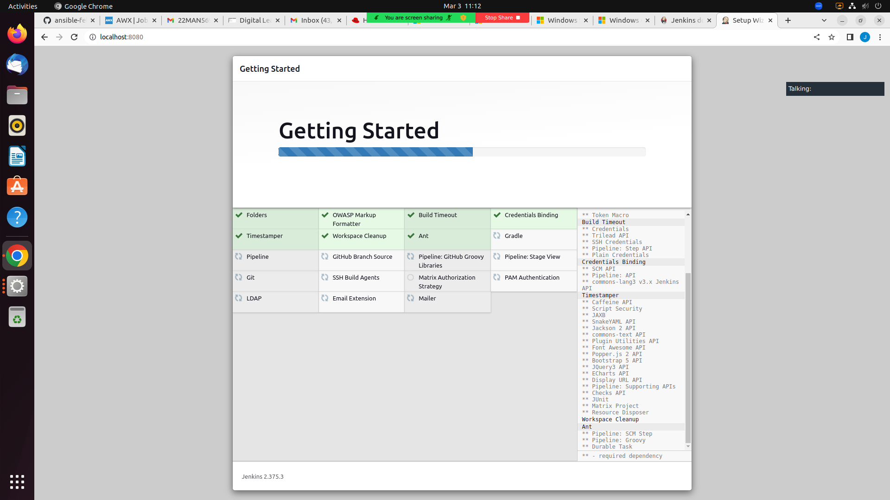
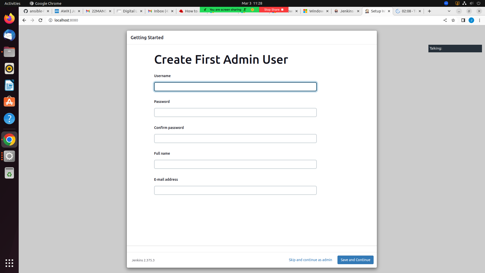
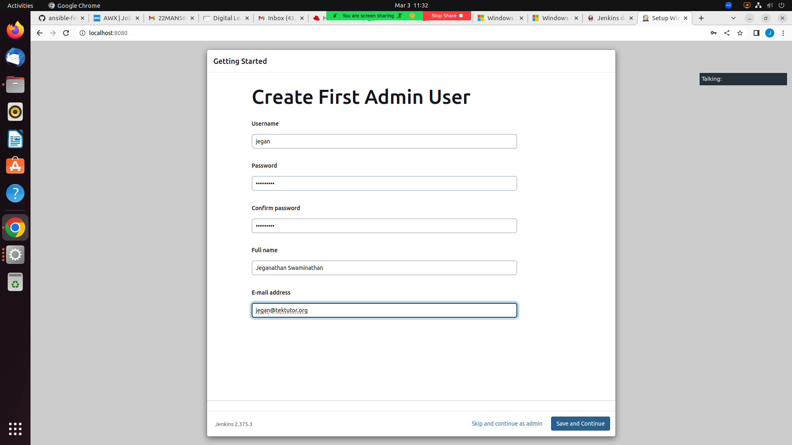
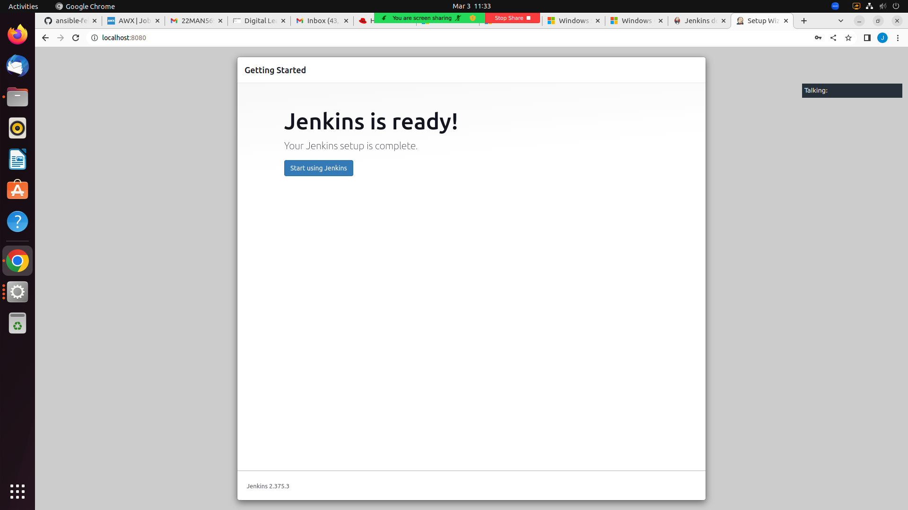
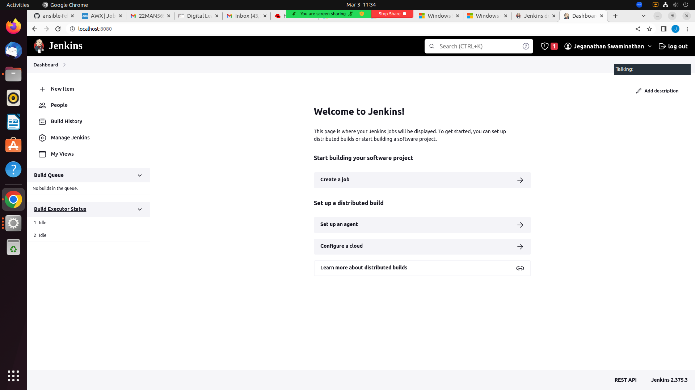
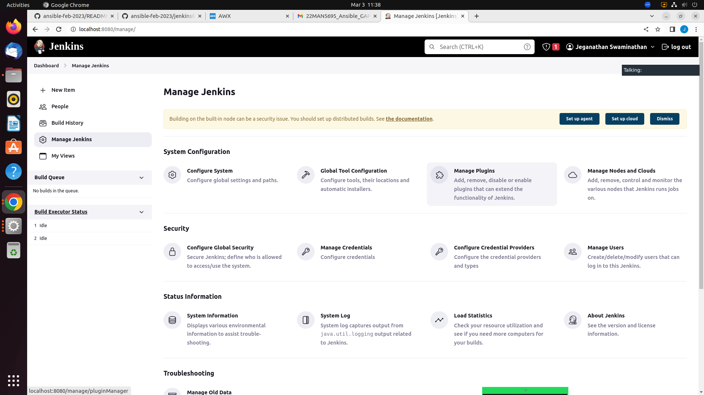
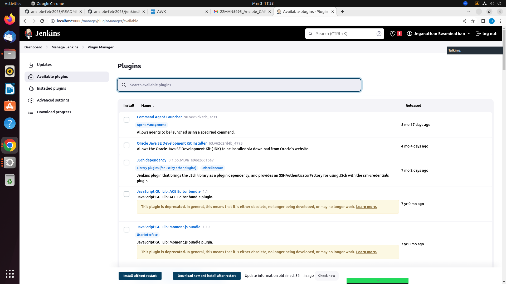
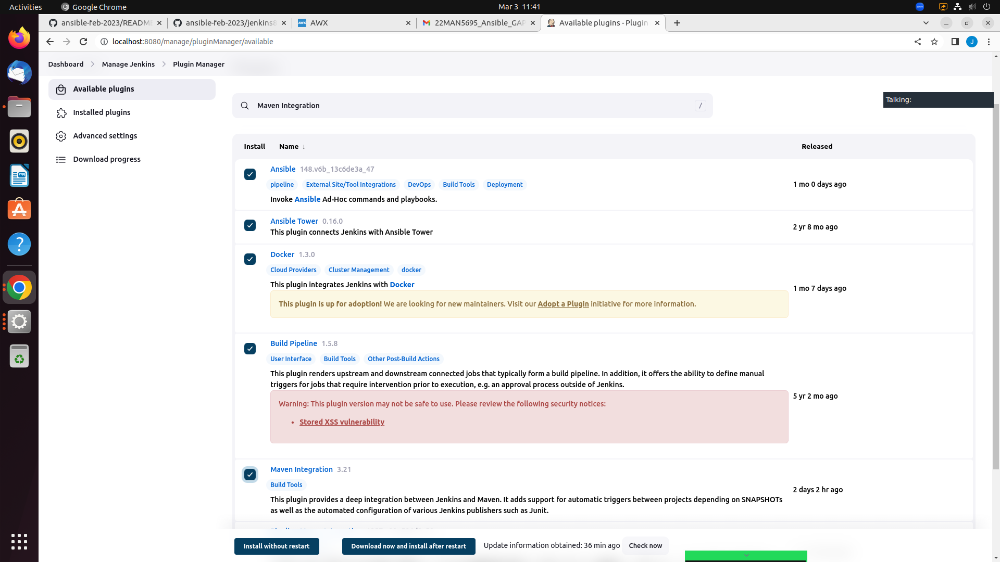
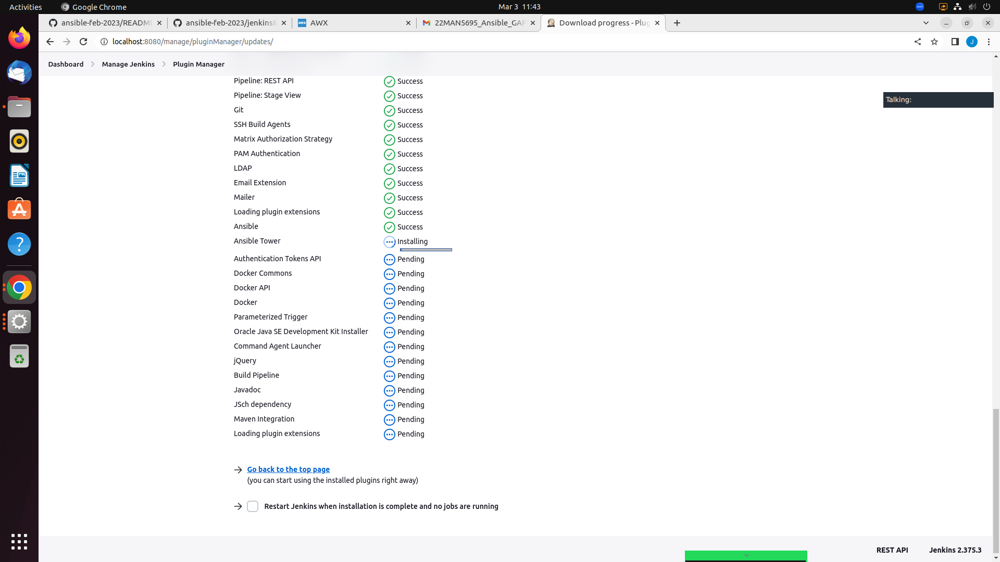
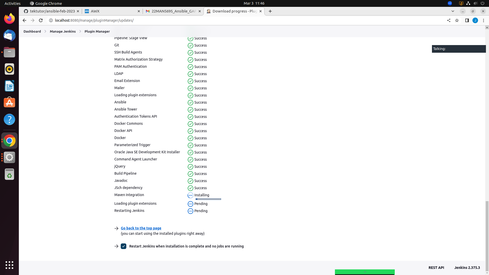

# Day 5 

## Install JDK 17
```
sudo apt install -y openjdk-17-jdk
```
Expected output
<pre>
jegan@tektutor.org:~/ansible-feb-2023/Day5/gs-spring-boot$ 
jegan@tektutor.org:~/ansible-feb-2023/Day5/gs-spring-boot$ javac -version

javac 17.0.6

jegan@tektutor.org:~/ansible-feb-2023/Day5/gs-spring-boot$ java -version
openjdk version "17.0.6" 2023-01-17
OpenJDK Runtime Environment (build 17.0.6+10-Ubuntu-0ubuntu122.04)
OpenJDK 64-Bit Server VM (build 17.0.6+10-Ubuntu-0ubuntu122.04, mixed mode, sharing)

jegan@tektutor.org:~/ansible-feb-2023/Day5/gs-spring-boot$ gradle --version

------------------------------------------------------------
Gradle 7.6.1
------------------------------------------------------------

Build time:   2023-02-24 13:54:42 UTC
Revision:     3905fe8ac072bbd925c70ddbddddf4463341f4b4

Kotlin:       1.7.10
Groovy:       3.0.13
Ant:          Apache Ant(TM) version 1.10.11 compiled on July 10 2021
JVM:          17.0.6 (Private Build 17.0.6+10-Ubuntu-0ubuntu122.04)
OS:           Linux 5.19.0-35-generic amd64

</pre>


## Installing Gradle in Linux

```
cd ~/Downloads
wget https://services.gradle.org/distributions/gradle-7.6.1-bin.zip
unzip gradle-7.6.1-bin.zip
```

Expected output
<pre>
jegan@tektutor.org  ~/Downloads $ <b>wget https://services.gradle.org/distributions/gradle-7.6.1-bin.zip</b>
--2023-03-03 12:02:33--  https://services.gradle.org/distributions/gradle-7.6.1-bin.zip
Resolving services.gradle.org (services.gradle.org)... 104.17.10.66, 104.17.46.54, 2606:4700::6811:2e36, ...
Connecting to services.gradle.org (services.gradle.org)|104.17.10.66|:443... connected.
HTTP request sent, awaiting response... 301 Moved Permanently
Location: https://downloads.gradle-dn.com/distributions/gradle-7.6.1-bin.zip [following]
--2023-03-03 12:02:33--  https://downloads.gradle-dn.com/distributions/gradle-7.6.1-bin.zip
Resolving downloads.gradle-dn.com (downloads.gradle-dn.com)... 104.17.140.32, 104.17.139.32, 2606:4700::6811:8b20, ...
Connecting to downloads.gradle-dn.com (downloads.gradle-dn.com)|104.17.140.32|:443... connected.
HTTP request sent, awaiting response... 200 OK
Length: 122052640 (116M) [application/zip]
Saving to: ‘gradle-7.6.1-bin.zip’

gradle-7.6.1-bin.zip               100%[================================================================>] 116.40M  24.1MB/s    in 4.9s    

2023-03-03 12:02:38 (23.8 MB/s) - ‘gradle-7.6.1-bin.zip’ saved [122052640/122052640]

 jegan@tektutor.org  ~/Downloads $ <b>ls</b>
'17763.3650.221105-1748.rs5_release_svc_refresh_SERVER_EVAL_x64FRE_en-us (1).iso'   CentOS-7-x86_64-DVD-2009.iso   jenkins.war
 awx.yml                                                                            gradle-7.6.1-bin.zip
 
 jegan@tektutor.org  ~/Downloads $ <b>unzip gradle-7.6.1-bin.zip</b>
  Archive:  gradle-7.6.1-bin.zip
   creating: gradle-7.6.1/
  inflating: gradle-7.6.1/LICENSE    
  inflating: gradle-7.6.1/NOTICE     
  inflating: gradle-7.6.1/README     
   creating: gradle-7.6.1/init.d/
  inflating: gradle-7.6.1/init.d/readme.txt  
   creating: gradle-7.6.1/bin/
  inflating: gradle-7.6.1/bin/gradle  
  inflating: gradle-7.6.1/bin/gradle.bat  
   creating: gradle-7.6.1/lib/
  inflating: gradle-7.6.1/lib/gradle-runtime-api-info-7.6.1.jar  
  inflating: gradle-7.6.1/lib/gradle-installation-beacon-7.6.1.jar  
  inflating: gradle-7.6.1/lib/gradle-api-metadata-7.6.1.jar  
  inflating: gradle-7.6.1/lib/gradle-launcher-7.6.1.jar  
  inflating: gradle-7.6.1/lib/gradle-kotlin-dsl-7.6.1.jar  
  inflating: gradle-7.6.1/lib/gradle-build-events-7.6.1.jar  
  inflating: gradle-7.6.1/lib/gradle-tooling-api-7.6.1.jar  
  inflating: gradle-7.6.1/lib/gradle-core-7.6.1.jar  
  inflating: gradle-7.6.1/lib/gradle-jvm-services-7.6.1.jar  
  inflating: gradle-7.6.1/lib/gradle-file-collections-7.6.1.jar  
  inflating: gradle-7.6.1/lib/gradle-execution-7.6.1.jar  
  inflating: gradle-7.6.1/lib/gradle-model-groovy-7.6.1.jar  
  inflating: gradle-7.6.1/lib/gradle-model-core-7.6.1.jar  
  inflating: gradle-7.6.1/lib/gradle-build-cache-7.6.1.jar  
  inflating: gradle-7.6.1/lib/gradle-core-api-7.6.1.jar  
  inflating: gradle-7.6.1/lib/gradle-persistent-cache-7.6.1.jar  
  inflating: gradle-7.6.1/lib/gradle-resources-7.6.1.jar  
  inflating: gradle-7.6.1/lib/gradle-worker-processes-7.6.1.jar  
  inflating: gradle-7.6.1/lib/gradle-logging-7.6.1.jar  
  inflating: gradle-7.6.1/lib/groovy-ant-3.0.13.jar  
  inflating: gradle-7.6.1/lib/ant-junit-1.10.12.jar  
  inflating: gradle-7.6.1/lib/ant-1.10.11.jar  
  inflating: gradle-7.6.1/lib/ant-launcher-1.10.11.jar  
  inflating: gradle-7.6.1/lib/gradle-process-services-7.6.1.jar  
  inflating: gradle-7.6.1/lib/gradle-messaging-7.6.1.jar  
  inflating: gradle-7.6.1/lib/gradle-build-option-7.6.1.jar  
  inflating: gradle-7.6.1/lib/gradle-native-7.6.1.jar  
  inflating: gradle-7.6.1/lib/gradle-base-services-groovy-7.6.1.jar  
  inflating: gradle-7.6.1/lib/gradle-file-temp-7.6.1.jar  
  inflating: gradle-7.6.1/lib/gradle-base-services-7.6.1.jar  
  inflating: gradle-7.6.1/lib/gradle-normalization-java-7.6.1.jar  
  inflating: gradle-7.6.1/lib/asm-commons-9.3.jar  
  inflating: gradle-7.6.1/lib/asm-analysis-9.3.jar  
  inflating: gradle-7.6.1/lib/asm-tree-9.3.jar  
  inflating: gradle-7.6.1/lib/asm-9.3.jar  
  inflating: gradle-7.6.1/lib/gradle-build-cache-packaging-7.6.1.jar  
  inflating: gradle-7.6.1/lib/commons-compress-1.21.jar  
  inflating: gradle-7.6.1/lib/commons-io-2.11.0.jar  
  inflating: gradle-7.6.1/lib/commons-lang-2.6.jar  
  inflating: gradle-7.6.1/lib/fastutil-8.5.2-min.jar  
  inflating: gradle-7.6.1/lib/gradle-file-watching-7.6.1.jar  
  inflating: gradle-7.6.1/lib/gradle-snapshots-7.6.1.jar  
  inflating: gradle-7.6.1/lib/gradle-build-cache-base-7.6.1.jar  
  inflating: gradle-7.6.1/lib/gradle-files-7.6.1.jar  
  inflating: gradle-7.6.1/lib/gradle-hashing-7.6.1.jar  
  inflating: gradle-7.6.1/lib/guava-31.1-jre.jar  
  inflating: gradle-7.6.1/lib/groovy-json-3.0.13.jar  
  inflating: gradle-7.6.1/lib/groovy-astbuilder-3.0.13.jar  
  inflating: gradle-7.6.1/lib/groovy-console-3.0.13.jar  
  inflating: gradle-7.6.1/lib/groovy-dateutil-3.0.13.jar  
  inflating: gradle-7.6.1/lib/groovy-datetime-3.0.13.jar  
  inflating: gradle-7.6.1/lib/groovy-groovydoc-3.0.13.jar  
  inflating: gradle-7.6.1/lib/groovy-nio-3.0.13.jar  
  inflating: gradle-7.6.1/lib/groovy-sql-3.0.13.jar  
  inflating: gradle-7.6.1/lib/groovy-docgenerator-3.0.13.jar  
  inflating: gradle-7.6.1/lib/groovy-templates-3.0.13.jar  
  inflating: gradle-7.6.1/lib/groovy-test-3.0.13.jar  
  inflating: gradle-7.6.1/lib/groovy-xml-3.0.13.jar  
  inflating: gradle-7.6.1/lib/groovy-swing-3.0.13.jar  
  inflating: gradle-7.6.1/lib/groovy-3.0.13.jar  
  inflating: gradle-7.6.1/lib/junit-4.13.2.jar  
  inflating: gradle-7.6.1/lib/hamcrest-core-1.3.jar  
  inflating: gradle-7.6.1/lib/javax.inject-1.jar  
  inflating: gradle-7.6.1/lib/jansi-1.18.jar  
  inflating: gradle-7.6.1/lib/jcl-over-slf4j-1.7.30.jar  
  inflating: gradle-7.6.1/lib/kotlin-stdlib-jdk8-1.7.10.jar  
  inflating: gradle-7.6.1/lib/kotlin-compiler-embeddable-1.7.10.jar  
  inflating: gradle-7.6.1/lib/kotlin-stdlib-jdk7-1.7.10.jar  
  inflating: gradle-7.6.1/lib/kotlin-reflect-1.7.10.jar  
  inflating: gradle-7.6.1/lib/kotlin-stdlib-1.7.10.jar  
  inflating: gradle-7.6.1/lib/annotations-20.1.0.jar  
  inflating: gradle-7.6.1/lib/gradle-enterprise-operations-7.6.1.jar  
  inflating: gradle-7.6.1/lib/gradle-functional-7.6.1.jar  
  inflating: gradle-7.6.1/lib/gradle-bootstrap-7.6.1.jar  
  inflating: gradle-7.6.1/lib/gradle-problems-7.6.1.jar  
  inflating: gradle-7.6.1/lib/gradle-kotlin-dsl-tooling-models-7.6.1.jar  
  inflating: gradle-7.6.1/lib/gradle-worker-services-7.6.1.jar  
  inflating: gradle-7.6.1/lib/gradle-enterprise-logging-7.6.1.jar  
  inflating: gradle-7.6.1/lib/gradle-build-operations-7.6.1.jar  
  inflating: gradle-7.6.1/lib/gradle-enterprise-workers-7.6.1.jar  
  inflating: gradle-7.6.1/lib/gradle-logging-api-7.6.1.jar  
  inflating: gradle-7.6.1/lib/gradle-base-annotations-7.6.1.jar  
  inflating: gradle-7.6.1/lib/tomlj-1.0.0.jar  
  inflating: gradle-7.6.1/lib/jsr305-3.0.2.jar  
  inflating: gradle-7.6.1/lib/jul-to-slf4j-1.7.30.jar  
  inflating: gradle-7.6.1/lib/kryo-2.24.0.jar  
  inflating: gradle-7.6.1/lib/log4j-over-slf4j-1.7.30.jar  
  inflating: gradle-7.6.1/lib/minlog-1.2.jar  
  inflating: gradle-7.6.1/lib/native-platform-0.22-milestone-24.jar  
  inflating: gradle-7.6.1/lib/file-events-0.22-milestone-24.jar  
  inflating: gradle-7.6.1/lib/objenesis-2.6.jar  
  inflating: gradle-7.6.1/lib/slf4j-api-1.7.30.jar  
  inflating: gradle-7.6.1/lib/trove4j-1.0.20200330.jar  
  inflating: gradle-7.6.1/lib/jna-5.10.0.jar  
  inflating: gradle-7.6.1/lib/xml-apis-1.4.01.jar  
  inflating: gradle-7.6.1/lib/javaparser-core-3.17.0.jar  
  inflating: gradle-7.6.1/lib/gradle-cli-7.6.1.jar  
  inflating: gradle-7.6.1/lib/gradle-wrapper-shared-7.6.1.jar  
  inflating: gradle-7.6.1/lib/kotlin-script-runtime-1.7.10.jar  
  inflating: gradle-7.6.1/lib/kotlin-daemon-embeddable-1.7.10.jar  
  inflating: gradle-7.6.1/lib/kotlin-scripting-common-1.7.10.jar  
  inflating: gradle-7.6.1/lib/kotlin-scripting-jvm-1.7.10.jar  
  inflating: gradle-7.6.1/lib/kotlin-scripting-jvm-host-1.7.10.jar  
  inflating: gradle-7.6.1/lib/kotlin-scripting-compiler-embeddable-1.7.10.jar  
  inflating: gradle-7.6.1/lib/kotlin-scripting-compiler-impl-embeddable-1.7.10.jar  
  inflating: gradle-7.6.1/lib/kotlin-sam-with-receiver-compiler-plugin-1.7.10.jar  
  inflating: gradle-7.6.1/lib/kotlinx-metadata-jvm-0.5.0.jar  
  inflating: gradle-7.6.1/lib/failureaccess-1.0.1.jar  
  inflating: gradle-7.6.1/lib/native-platform-freebsd-amd64-libcpp-0.22-milestone-24.jar  
  inflating: gradle-7.6.1/lib/native-platform-linux-aarch64-0.22-milestone-24.jar  
  inflating: gradle-7.6.1/lib/native-platform-linux-amd64-0.22-milestone-24.jar  
  inflating: gradle-7.6.1/lib/native-platform-osx-aarch64-0.22-milestone-24.jar  
  inflating: gradle-7.6.1/lib/native-platform-osx-amd64-0.22-milestone-24.jar  
  inflating: gradle-7.6.1/lib/native-platform-windows-amd64-0.22-milestone-24.jar  
  inflating: gradle-7.6.1/lib/native-platform-windows-amd64-min-0.22-milestone-24.jar  
  inflating: gradle-7.6.1/lib/native-platform-windows-i386-0.22-milestone-24.jar  
  inflating: gradle-7.6.1/lib/native-platform-windows-i386-min-0.22-milestone-24.jar  
  inflating: gradle-7.6.1/lib/native-platform-linux-aarch64-ncurses5-0.22-milestone-24.jar  
  inflating: gradle-7.6.1/lib/native-platform-linux-aarch64-ncurses6-0.22-milestone-24.jar  
  inflating: gradle-7.6.1/lib/native-platform-linux-amd64-ncurses5-0.22-milestone-24.jar  
  inflating: gradle-7.6.1/lib/native-platform-linux-amd64-ncurses6-0.22-milestone-24.jar  
  inflating: gradle-7.6.1/lib/file-events-linux-aarch64-0.22-milestone-24.jar  
  inflating: gradle-7.6.1/lib/file-events-linux-amd64-0.22-milestone-24.jar  
  inflating: gradle-7.6.1/lib/file-events-osx-aarch64-0.22-milestone-24.jar  
  inflating: gradle-7.6.1/lib/file-events-osx-amd64-0.22-milestone-24.jar  
  inflating: gradle-7.6.1/lib/file-events-windows-amd64-0.22-milestone-24.jar  
  inflating: gradle-7.6.1/lib/file-events-windows-amd64-min-0.22-milestone-24.jar  
  inflating: gradle-7.6.1/lib/file-events-windows-i386-0.22-milestone-24.jar  
  inflating: gradle-7.6.1/lib/file-events-windows-i386-min-0.22-milestone-24.jar  
  inflating: gradle-7.6.1/lib/ant-antlr-1.10.12.jar  
  inflating: gradle-7.6.1/lib/antlr4-runtime-4.7.2.jar  
  inflating: gradle-7.6.1/lib/kotlin-stdlib-common-1.7.10.jar  
  inflating: gradle-7.6.1/lib/qdox-1.12.1.jar  
   creating: gradle-7.6.1/lib/plugins/
  inflating: gradle-7.6.1/lib/plugins/gradle-kotlin-dsl-provider-plugins-7.6.1.jar  
  inflating: gradle-7.6.1/lib/plugins/gradle-plugin-development-7.6.1.jar  
  inflating: gradle-7.6.1/lib/plugins/gradle-build-init-7.6.1.jar  
  inflating: gradle-7.6.1/lib/plugins/gradle-build-profile-7.6.1.jar  
  inflating: gradle-7.6.1/lib/plugins/gradle-antlr-7.6.1.jar  
  inflating: gradle-7.6.1/lib/plugins/gradle-enterprise-7.6.1.jar  
  inflating: gradle-7.6.1/lib/plugins/gradle-configuration-cache-7.6.1.jar  
  inflating: gradle-7.6.1/lib/plugins/gradle-tooling-api-builders-7.6.1.jar  
  inflating: gradle-7.6.1/lib/plugins/gradle-kotlin-dsl-tooling-builders-7.6.1.jar  
  inflating: gradle-7.6.1/lib/plugins/gradle-testing-junit-platform-7.6.1.jar  
  inflating: gradle-7.6.1/lib/plugins/junit-platform-launcher-1.8.2.jar  
  inflating: gradle-7.6.1/lib/plugins/junit-platform-engine-1.8.2.jar  
  inflating: gradle-7.6.1/lib/plugins/junit-platform-commons-1.8.2.jar  
  inflating: gradle-7.6.1/lib/plugins/gradle-code-quality-7.6.1.jar  
  inflating: gradle-7.6.1/lib/plugins/gradle-signing-7.6.1.jar  
  inflating: gradle-7.6.1/lib/plugins/gradle-tooling-native-7.6.1.jar  
  inflating: gradle-7.6.1/lib/plugins/gradle-ide-native-7.6.1.jar  
  inflating: gradle-7.6.1/lib/plugins/gradle-ide-7.6.1.jar  
  inflating: gradle-7.6.1/lib/plugins/gradle-scala-7.6.1.jar  
  inflating: gradle-7.6.1/lib/plugins/gradle-ear-7.6.1.jar  
  inflating: gradle-7.6.1/lib/plugins/gradle-jacoco-7.6.1.jar  
  inflating: gradle-7.6.1/lib/plugins/gradle-testing-native-7.6.1.jar  
  inflating: gradle-7.6.1/lib/plugins/gradle-language-native-7.6.1.jar  
  inflating: gradle-7.6.1/lib/plugins/gradle-maven-7.6.1.jar  
  inflating: gradle-7.6.1/lib/plugins/gradle-ivy-7.6.1.jar  
  inflating: gradle-7.6.1/lib/plugins/gradle-plugins-7.6.1.jar  
  inflating: gradle-7.6.1/lib/plugins/gradle-testing-jvm-7.6.1.jar  
  inflating: gradle-7.6.1/lib/plugins/gradle-language-groovy-7.6.1.jar  
  inflating: gradle-7.6.1/lib/plugins/gradle-language-java-7.6.1.jar  
  inflating: gradle-7.6.1/lib/plugins/gradle-language-jvm-7.6.1.jar  
  inflating: gradle-7.6.1/lib/plugins/gradle-platform-jvm-7.6.1.jar  
  inflating: gradle-7.6.1/lib/plugins/gradle-composite-builds-7.6.1.jar  
  inflating: gradle-7.6.1/lib/plugins/gradle-plugin-use-7.6.1.jar  
  inflating: gradle-7.6.1/lib/plugins/gradle-publish-7.6.1.jar  
  inflating: gradle-7.6.1/lib/plugins/gradle-testing-base-7.6.1.jar  
  inflating: gradle-7.6.1/lib/plugins/gradle-platform-native-7.6.1.jar  
  inflating: gradle-7.6.1/lib/plugins/gradle-diagnostics-7.6.1.jar  
  inflating: gradle-7.6.1/lib/plugins/gradle-platform-base-7.6.1.jar  
  inflating: gradle-7.6.1/lib/plugins/gradle-version-control-7.6.1.jar  
  inflating: gradle-7.6.1/lib/plugins/gradle-dependency-management-7.6.1.jar  
  inflating: gradle-7.6.1/lib/plugins/gradle-reporting-7.6.1.jar  
  inflating: gradle-7.6.1/lib/plugins/gradle-workers-7.6.1.jar  
  inflating: gradle-7.6.1/lib/plugins/gradle-test-kit-7.6.1.jar  
  inflating: gradle-7.6.1/lib/plugins/gradle-resources-s3-7.6.1.jar  
  inflating: gradle-7.6.1/lib/plugins/gradle-resources-gcs-7.6.1.jar  
  inflating: gradle-7.6.1/lib/plugins/gradle-build-cache-http-7.6.1.jar  
  inflating: gradle-7.6.1/lib/plugins/gradle-security-7.6.1.jar  
  inflating: gradle-7.6.1/lib/plugins/gradle-resources-http-7.6.1.jar  
  inflating: gradle-7.6.1/lib/plugins/gradle-resources-sftp-7.6.1.jar  
  inflating: gradle-7.6.1/lib/plugins/aws-java-sdk-s3-1.11.948.jar  
  inflating: gradle-7.6.1/lib/plugins/aws-java-sdk-kms-1.11.948.jar  
  inflating: gradle-7.6.1/lib/plugins/aws-java-sdk-sts-1.11.948.jar  
  inflating: gradle-7.6.1/lib/plugins/aws-java-sdk-core-1.11.948.jar  
  inflating: gradle-7.6.1/lib/plugins/org.eclipse.jgit-5.7.0.202003110725-r.jar  
  inflating: gradle-7.6.1/lib/plugins/bcpg-jdk15on-1.68.jar  
  inflating: gradle-7.6.1/lib/plugins/bcpkix-jdk15on-1.68.jar  
  inflating: gradle-7.6.1/lib/plugins/bcprov-jdk15on-1.68.jar  
  inflating: gradle-7.6.1/lib/plugins/testng-6.3.1.jar  
  inflating: gradle-7.6.1/lib/plugins/bsh-2.0b6.jar  
  inflating: gradle-7.6.1/lib/plugins/capsule-0.6.3.jar  
  inflating: gradle-7.6.1/lib/plugins/google-api-services-storage-v1-rev20220705-1.32.1.jar  
  inflating: gradle-7.6.1/lib/plugins/google-api-client-1.34.0.jar  
  inflating: gradle-7.6.1/lib/plugins/google-http-client-apache-v2-1.42.2.jar  
  inflating: gradle-7.6.1/lib/plugins/google-oauth-client-1.34.1.jar  
  inflating: gradle-7.6.1/lib/plugins/google-http-client-gson-1.42.2.jar  
  inflating: gradle-7.6.1/lib/plugins/google-http-client-1.42.2.jar  
  inflating: gradle-7.6.1/lib/plugins/httpclient-4.5.13.jar  
  inflating: gradle-7.6.1/lib/plugins/commons-codec-1.15.jar  
  inflating: gradle-7.6.1/lib/plugins/opencensus-contrib-http-util-0.31.1.jar  
  inflating: gradle-7.6.1/lib/plugins/gson-2.8.9.jar  
  inflating: gradle-7.6.1/lib/plugins/httpcore-4.4.14.jar  
  inflating: gradle-7.6.1/lib/plugins/maven-settings-builder-3.6.3.jar  
  inflating: gradle-7.6.1/lib/plugins/ivy-2.3.0.jar  
  inflating: gradle-7.6.1/lib/plugins/jackson-core-2.13.3.jar  
  inflating: gradle-7.6.1/lib/plugins/jmespath-java-1.11.948.jar  
  inflating: gradle-7.6.1/lib/plugins/jackson-databind-2.13.3.jar  
  inflating: gradle-7.6.1/lib/plugins/jackson-annotations-2.13.3.jar  
  inflating: gradle-7.6.1/lib/plugins/jaxb-impl-3.0.0.jar  
  inflating: gradle-7.6.1/lib/plugins/jaxb-core-3.0.0.jar  
  inflating: gradle-7.6.1/lib/plugins/jakarta.xml.bind-api-3.0.0.jar  
  inflating: gradle-7.6.1/lib/plugins/jakarta.activation-2.0.0.jar  
  inflating: gradle-7.6.1/lib/plugins/jatl-0.2.3.jar  
  inflating: gradle-7.6.1/lib/plugins/jcifs-1.3.17.jar  
  inflating: gradle-7.6.1/lib/plugins/jcommander-1.78.jar  
  inflating: gradle-7.6.1/lib/plugins/joda-time-2.10.4.jar  
  inflating: gradle-7.6.1/lib/plugins/jsch-0.1.55.jar  
  inflating: gradle-7.6.1/lib/plugins/jsoup-1.15.1.jar  
  inflating: gradle-7.6.1/lib/plugins/jzlib-1.1.3.jar  
  inflating: gradle-7.6.1/lib/plugins/maven-builder-support-3.6.3.jar  
  inflating: gradle-7.6.1/lib/plugins/maven-model-3.6.3.jar  
  inflating: gradle-7.6.1/lib/plugins/maven-repository-metadata-3.6.3.jar  
  inflating: gradle-7.6.1/lib/plugins/maven-settings-3.6.3.jar  
  inflating: gradle-7.6.1/lib/plugins/plexus-sec-dispatcher-1.4.jar  
  inflating: gradle-7.6.1/lib/plugins/plexus-cipher-1.7.jar  
  inflating: gradle-7.6.1/lib/plugins/plexus-interpolation-1.26.jar  
  inflating: gradle-7.6.1/lib/plugins/plexus-utils-3.3.0.jar  
  inflating: gradle-7.6.1/lib/plugins/dd-plist-1.21.jar  
  inflating: gradle-7.6.1/lib/plugins/snakeyaml-1.32.jar  
  inflating: gradle-7.6.1/lib/plugins/gradle-wrapper-7.6.1.jar  
  inflating: gradle-7.6.1/lib/plugins/gradle-java-compiler-plugin-7.6.1.jar  
  inflating: gradle-7.6.1/lib/plugins/ion-java-1.0.2.jar  
  inflating: gradle-7.6.1/lib/plugins/opentest4j-1.2.0.jar  
  inflating: gradle-7.6.1/lib/plugins/opencensus-api-0.31.1.jar  
  inflating: gradle-7.6.1/lib/plugins/grpc-context-1.27.2.jar  
  
jegan@tektutor.org  ~/Downloads $ <b>cd gradle-7.6.1</b>
jegan@tektutor.org  ~/Downloads/gradle-7.6.1 $ <b>ls</b>
bin  init.d  lib  LICENSE  NOTICE  README
jegan@tektutor.org  ~/Downloads/gradle-7.6.1 $ <b>pwd</b>
<b>/home/jegan/Downloads/gradle-7.6.1</b>
</pre>

Similarly, find your JAVA Home folder
<pre>
jegan@tektutor.org:~/ansible-feb-2023/Day5/gs-spring-boot$ javac -version
javac 17.0.6

jegan@tektutor.org:~/ansible-feb-2023/Day5/gs-spring-boot$ java -version
openjdk version "17.0.6" 2023-01-17
OpenJDK Runtime Environment (build 17.0.6+10-Ubuntu-0ubuntu122.04)
OpenJDK 64-Bit Server VM (build 17.0.6+10-Ubuntu-0ubuntu122.04, mixed mode, sharing)

jegan@tektutor.org:~/ansible-feb-2023/Day5/gs-spring-boot$ gradle --version

------------------------------------------------------------
Gradle 7.6.1
------------------------------------------------------------

Build time:   2023-02-24 13:54:42 UTC
Revision:     3905fe8ac072bbd925c70ddbddddf4463341f4b4

Kotlin:       1.7.10
Groovy:       3.0.13
Ant:          Apache Ant(TM) version 1.10.11 compiled on July 10 2021
JVM:          17.0.6 (Private Build 17.0.6+10-Ubuntu-0ubuntu122.04)
OS:           Linux 5.19.0-35-generic amd64

</pre>

### Exporting the JDK and Grade path to environment settings
Edit ~/.bashrc file and at the end of the file paste the below
<pre>
export JAVA_HOME=/usr/lib/jvm/java-17-openjdk-amd64
export GRADLE_HOME=/home/jegan/Downloads/gradle-7.6.1
export PATH=$JAVA_HOME/bin:$GRADLE_HOME/bin:$PATH
</pre>

In order to apply the ~/.bashrc changes, you need to source the ~/.bashrc as shown below
<pre>
jegan@tektutor.org:~/Downloads/gradle-7.6.1$ <b>source ~/.bashrc</b>
jegan@tektutor.org:~/Downloads/gradle-7.6.1$ <b>gradle --version</b>

jegan@tektutor.org:~/ansible-feb-2023/Day5/gs-spring-boot$ gradle --version

------------------------------------------------------------
Gradle 7.6.1
------------------------------------------------------------

Build time:   2023-02-24 13:54:42 UTC
Revision:     3905fe8ac072bbd925c70ddbddddf4463341f4b4

Kotlin:       1.7.10
Groovy:       3.0.13
Ant:          Apache Ant(TM) version 1.10.11 compiled on July 10 2021
JVM:          17.0.6 (Private Build 17.0.6+10-Ubuntu-0ubuntu122.04)
OS:           Linux 5.19.0-35-generic amd64
</pre>

## Setup Jenkins CI Build Server
```
cd ~/Downloads
wget https://get.jenkins.io/war-stable/2.375.3/jenkins.war
java -jar ./jenkins.war
```

Expected output
<pre>
jegan@tektutor.org  ~/Downloads $ <b>java -jar ./jenkins.war</b>

Running from: /home/jegan/Downloads/jenkins.war
webroot: $user.home/.jenkins
2023-03-03 05:32:29.635+0000 [id=1]	INFO	winstone.Logger#logInternal: Beginning extraction from war file
2023-03-03 05:32:30.617+0000 [id=1]	WARNING	o.e.j.s.handler.ContextHandler#setContextPath: Empty contextPath
2023-03-03 05:32:30.678+0000 [id=1]	INFO	org.eclipse.jetty.server.Server#doStart: jetty-10.0.12; built: 2022-09-14T01:54:40.076Z; git: 408d0139887e27a57b54ed52e2d92a36731a7e88; jvm 11.0.18+10-post-Ubuntu-0ubuntu122.04
2023-03-03 05:32:30.951+0000 [id=1]	INFO	o.e.j.w.StandardDescriptorProcessor#visitServlet: NO JSP Support for /, did not find org.eclipse.jetty.jsp.JettyJspServlet
2023-03-03 05:32:31.001+0000 [id=1]	INFO	o.e.j.s.s.DefaultSessionIdManager#doStart: Session workerName=node0
2023-03-03 05:32:31.461+0000 [id=1]	INFO	hudson.WebAppMain#contextInitialized: Jenkins home directory: /home/jegan/.jenkins found at: $user.home/.jenkins
2023-03-03 05:32:31.644+0000 [id=1]	INFO	o.e.j.s.handler.ContextHandler#doStart: Started w.@681adc8f{Jenkins v2.375.3,/,file:///home/jegan/.jenkins/war/,AVAILABLE}{/home/jegan/.jenkins/war}
2023-03-03 05:32:31.702+0000 [id=1]	INFO	o.e.j.server.AbstractConnector#doStart: Started ServerConnector@6c0d7c83{HTTP/1.1, (http/1.1)}{0.0.0.0:8080}
2023-03-03 05:32:31.749+0000 [id=1]	INFO	org.eclipse.jetty.server.Server#doStart: Started Server@345f69f3{STARTING}[10.0.12,sto=0] @2548ms
2023-03-03 05:32:31.755+0000 [id=45]	INFO	winstone.Logger#logInternal: Winstone Servlet Engine running: controlPort=disabled
2023-03-03 05:32:31.967+0000 [id=51]	INFO	jenkins.InitReactorRunner$1#onAttained: Started initialization
2023-03-03 05:32:31.980+0000 [id=71]	INFO	jenkins.InitReactorRunner$1#onAttained: Listed all plugins
2023-03-03 05:32:32.694+0000 [id=79]	INFO	jenkins.InitReactorRunner$1#onAttained: Prepared all plugins
2023-03-03 05:32:32.707+0000 [id=88]	INFO	jenkins.InitReactorRunner$1#onAttained: Started all plugins
2023-03-03 05:32:32.722+0000 [id=96]	INFO	jenkins.InitReactorRunner$1#onAttained: Augmented all extensions
2023-03-03 05:32:32.930+0000 [id=116]	INFO	jenkins.InitReactorRunner$1#onAttained: System config loaded
2023-03-03 05:32:32.932+0000 [id=120]	INFO	jenkins.InitReactorRunner$1#onAttained: System config adapted
2023-03-03 05:32:32.933+0000 [id=125]	INFO	jenkins.InitReactorRunner$1#onAttained: Loaded all jobs
2023-03-03 05:32:32.936+0000 [id=132]	INFO	jenkins.InitReactorRunner$1#onAttained: Configuration for all jobs updated
2023-03-03 05:32:32.969+0000 [id=151]	INFO	hudson.util.Retrier#start: Attempt #1 to do the action check updates server
WARNING: An illegal reflective access operation has occurred
WARNING: Illegal reflective access by org.codehaus.groovy.vmplugin.v7.Java7$1 (file:/home/jegan/.jenkins/war/WEB-INF/lib/groovy-all-2.4.21.jar) to constructor java.lang.invoke.MethodHandles$Lookup(java.lang.Class,int)
WARNING: Please consider reporting this to the maintainers of org.codehaus.groovy.vmplugin.v7.Java7$1
WARNING: Use --illegal-access=warn to enable warnings of further illegal reflective access operations
WARNING: All illegal access operations will be denied in a future release
2023-03-03 05:32:33.335+0000 [id=139]	INFO	jenkins.install.SetupWizard#init: 

*************************************************************
*************************************************************
*************************************************************

Jenkins initial setup is required. An admin user has been created and a password generated.
Please use the following password to proceed to installation:

a857e5bec77d448c9ac393dfbef25659

This may also be found at: /home/jegan/.jenkins/secrets/initialAdminPassword

*************************************************************
*************************************************************
*************************************************************

2023-03-03 05:32:48.329+0000 [id=156]	INFO	jenkins.InitReactorRunner$1#onAttained: Completed initialization
2023-03-03 05:32:48.365+0000 [id=35]	INFO	hudson.lifecycle.Lifecycle#onReady: <b>Jenkins is fully up and running</b>
2023-03-03 05:32:49.383+0000 [id=151]	INFO	h.m.DownloadService$Downloadable#load: Obtained the updated data file for hudson.tasks.Maven.MavenInstaller
2023-03-03 05:32:49.385+0000 [id=151]	INFO	hudson.util.Retrier#start: Performed the action check updates server successfully at the attempt #1
</pre>

#### Accessing Jenkins Dashboard from your RPS Chrome web browser
<pre>
http://localhost:8080
</pre>

Expected output


#### Install Suggested Plugins




#### Create user








Click on Install without Restart



