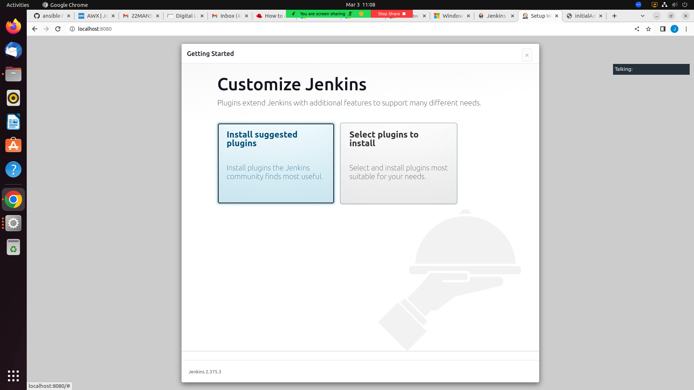

# Day 5 

## Install JDK 11
```
sudo apt install openjdk-11-jdk -y
```
Expected output
<pre>
jegan@tektutor.org  ~/Downloads $ <b>sudo apt install openjdk-11-jdk -y</b>
[sudo] password for jegan: 
Reading package lists... Done
Building dependency tree... Done
Reading state information... Done
The following additional packages will be installed:
  ca-certificates-java fonts-dejavu-extra java-common
  libatk-wrapper-java libatk-wrapper-java-jni libice-dev
  libpthread-stubs0-dev libsm-dev libx11-dev libxau-dev libxcb1-dev
  libxdmcp-dev libxt-dev openjdk-11-jdk-headless openjdk-11-jre
  openjdk-11-jre-headless x11proto-dev xorg-sgml-doctools xtrans-dev
Suggested packages:
  default-jre libice-doc libsm-doc libx11-doc libxcb-doc libxt-doc
  openjdk-11-demo openjdk-11-source visualvm fonts-ipafont-gothic
  fonts-ipafont-mincho fonts-wqy-microhei | fonts-wqy-zenhei
The following NEW packages will be installed:
  ca-certificates-java fonts-dejavu-extra java-common
  libatk-wrapper-java libatk-wrapper-java-jni libice-dev
  libpthread-stubs0-dev libsm-dev libx11-dev libxau-dev libxcb1-dev
  libxdmcp-dev libxt-dev openjdk-11-jdk openjdk-11-jdk-headless
  openjdk-11-jre openjdk-11-jre-headless x11proto-dev
  xorg-sgml-doctools xtrans-dev
0 upgraded, 20 newly installed, 0 to remove and 47 not upgraded.
Need to get 262 MB of archives.
After this operation, 413 MB of additional disk space will be used.
Get:1 http://in.archive.ubuntu.com/ubuntu jammy/main amd64 java-common all 0.72build2 [6,782 B]
Get:2 http://in.archive.ubuntu.com/ubuntu jammy-updates/main amd64 openjdk-11-jre-headless amd64 11.0.18+10-0ubuntu1~22.04 [41.6 MB]
Get:3 http://in.archive.ubuntu.com/ubuntu jammy-updates/main amd64 ca-certificates-java all 20190909ubuntu1.1 [12.0 kB]
Get:4 http://in.archive.ubuntu.com/ubuntu jammy/main amd64 fonts-dejavu-extra all 2.37-2build1 [2,041 kB]
Get:5 http://in.archive.ubuntu.com/ubuntu jammy/main amd64 libatk-wrapper-java all 0.38.0-5build1 [53.1 kB]
Get:6 http://in.archive.ubuntu.com/ubuntu jammy/main amd64 libatk-wrapper-java-jni amd64 0.38.0-5build1 [49.0 kB]
Get:7 http://in.archive.ubuntu.com/ubuntu jammy/main amd64 xorg-sgml-doctools all 1:1.11-1.1 [10.9 kB]
Get:8 http://in.archive.ubuntu.com/ubuntu jammy/main amd64 x11proto-dev all 2021.5-1 [604 kB]
Get:9 http://in.archive.ubuntu.com/ubuntu jammy/main amd64 libice-dev amd64 2:1.0.10-1build2 [51.4 kB]
Get:10 http://in.archive.ubuntu.com/ubuntu jammy/main amd64 libpthread-stubs0-dev amd64 0.4-1build2 [5,516 B]
Get:11 http://in.archive.ubuntu.com/ubuntu jammy/main amd64 libsm-dev amd64 2:1.2.3-1build2 [18.1 kB]
Get:12 http://in.archive.ubuntu.com/ubuntu jammy/main amd64 libxau-dev amd64 1:1.0.9-1build5 [9,724 B]
Get:13 http://in.archive.ubuntu.com/ubuntu jammy/main amd64 libxdmcp-dev amd64 1:1.1.3-0ubuntu5 [26.5 kB]
Get:14 http://in.archive.ubuntu.com/ubuntu jammy/main amd64 xtrans-dev all 1.4.0-1 [68.9 kB]
Get:15 http://in.archive.ubuntu.com/ubuntu jammy/main amd64 libxcb1-dev amd64 1.14-3ubuntu3 [86.5 kB]
Get:16 http://in.archive.ubuntu.com/ubuntu jammy/main amd64 libx11-dev amd64 2:1.7.5-1 [744 kB]
Get:17 http://in.archive.ubuntu.com/ubuntu jammy/main amd64 libxt-dev amd64 1:1.2.1-1 [396 kB]
Get:18 http://in.archive.ubuntu.com/ubuntu jammy-updates/main amd64 openjdk-11-jre amd64 11.0.18+10-0ubuntu1~22.04 [193 kB]
Get:19 http://in.archive.ubuntu.com/ubuntu jammy-updates/main amd64 openjdk-11-jdk-headless amd64 11.0.18+10-0ubuntu1~22.04 [214 MB]
Get:20 http://in.archive.ubuntu.com/ubuntu jammy-updates/main amd64 openjdk-11-jdk amd64 11.0.18+10-0ubuntu1~22.04 [1,564 kB]
Fetched 262 MB in 28s (9,299 kB/s)                                     
Selecting previously unselected package java-common.
(Reading database ... 251579 files and directories currently installed.)
Preparing to unpack .../00-java-common_0.72build2_all.deb ...
Unpacking java-common (0.72build2) ...
Selecting previously unselected package openjdk-11-jre-headless:amd64.
Preparing to unpack .../01-openjdk-11-jre-headless_11.0.18+10-0ubuntu1~2
2.04_amd64.deb ...
Unpacking openjdk-11-jre-headless:amd64 (11.0.18+10-0ubuntu1~22.04) ...
Selecting previously unselected package ca-certificates-java.
Preparing to unpack .../02-ca-certificates-java_20190909ubuntu1.1_all.de
b ...
Unpacking ca-certificates-java (20190909ubuntu1.1) ...
Selecting previously unselected package fonts-dejavu-extra.
Preparing to unpack .../03-fonts-dejavu-extra_2.37-2build1_all.deb ...
Unpacking fonts-dejavu-extra (2.37-2build1) ...
Selecting previously unselected package libatk-wrapper-java.
Preparing to unpack .../04-libatk-wrapper-java_0.38.0-5build1_all.deb ..
.
Unpacking libatk-wrapper-java (0.38.0-5build1) ...
Selecting previously unselected package libatk-wrapper-java-jni:amd64.
Preparing to unpack .../05-libatk-wrapper-java-jni_0.38.0-5build1_amd64.
deb ...
Unpacking libatk-wrapper-java-jni:amd64 (0.38.0-5build1) ...
Selecting previously unselected package xorg-sgml-doctools.
Preparing to unpack .../06-xorg-sgml-doctools_1%3a1.11-1.1_all.deb ...
Unpacking xorg-sgml-doctools (1:1.11-1.1) ...
Selecting previously unselected package x11proto-dev.
Preparing to unpack .../07-x11proto-dev_2021.5-1_all.deb ...
Unpacking x11proto-dev (2021.5-1) ...
Selecting previously unselected package libice-dev:amd64.
Preparing to unpack .../08-libice-dev_2%3a1.0.10-1build2_amd64.deb ...
Unpacking libice-dev:amd64 (2:1.0.10-1build2) ...
Selecting previously unselected package libpthread-stubs0-dev:amd64.
Preparing to unpack .../09-libpthread-stubs0-dev_0.4-1build2_amd64.deb .
..
Unpacking libpthread-stubs0-dev:amd64 (0.4-1build2) ...
Selecting previously unselected package libsm-dev:amd64.
Preparing to unpack .../10-libsm-dev_2%3a1.2.3-1build2_amd64.deb ...
Unpacking libsm-dev:amd64 (2:1.2.3-1build2) ...
Selecting previously unselected package libxau-dev:amd64.
Preparing to unpack .../11-libxau-dev_1%3a1.0.9-1build5_amd64.deb ...
Unpacking libxau-dev:amd64 (1:1.0.9-1build5) ...
Selecting previously unselected package libxdmcp-dev:amd64.
Preparing to unpack .../12-libxdmcp-dev_1%3a1.1.3-0ubuntu5_amd64.deb ...
Unpacking libxdmcp-dev:amd64 (1:1.1.3-0ubuntu5) ...
Selecting previously unselected package xtrans-dev.
Preparing to unpack .../13-xtrans-dev_1.4.0-1_all.deb ...
Unpacking xtrans-dev (1.4.0-1) ...
Selecting previously unselected package libxcb1-dev:amd64.
Preparing to unpack .../14-libxcb1-dev_1.14-3ubuntu3_amd64.deb ...
Unpacking libxcb1-dev:amd64 (1.14-3ubuntu3) ...
Selecting previously unselected package libx11-dev:amd64.
Preparing to unpack .../15-libx11-dev_2%3a1.7.5-1_amd64.deb ...
Unpacking libx11-dev:amd64 (2:1.7.5-1) ...
Selecting previously unselected package libxt-dev:amd64.
Preparing to unpack .../16-libxt-dev_1%3a1.2.1-1_amd64.deb ...
Unpacking libxt-dev:amd64 (1:1.2.1-1) ...
Selecting previously unselected package openjdk-11-jre:amd64.
Preparing to unpack .../17-openjdk-11-jre_11.0.18+10-0ubuntu1~22.04_amd6
4.deb ...
Unpacking openjdk-11-jre:amd64 (11.0.18+10-0ubuntu1~22.04) ...
Selecting previously unselected package openjdk-11-jdk-headless:amd64.
Preparing to unpack .../18-openjdk-11-jdk-headless_11.0.18+10-0ubuntu1~2
2.04_amd64.deb ...
Unpacking openjdk-11-jdk-headless:amd64 (11.0.18+10-0ubuntu1~22.04) ...
Selecting previously unselected package openjdk-11-jdk:amd64.
Preparing to unpack .../19-openjdk-11-jdk_11.0.18+10-0ubuntu1~22.04_amd6
4.deb ...
Unpacking openjdk-11-jdk:amd64 (11.0.18+10-0ubuntu1~22.04) ...
Setting up java-common (0.72build2) ...
Setting up libpthread-stubs0-dev:amd64 (0.4-1build2) ...
Setting up xtrans-dev (1.4.0-1) ...
Setting up fonts-dejavu-extra (2.37-2build1) ...
Setting up xorg-sgml-doctools (1:1.11-1.1) ...
Setting up libatk-wrapper-java (0.38.0-5build1) ...
Setting up libatk-wrapper-java-jni:amd64 (0.38.0-5build1) ...
Setting up openjdk-11-jre-headless:amd64 (11.0.18+10-0ubuntu1~22.04) ...
update-alternatives: using /usr/lib/jvm/java-11-openjdk-amd64/bin/java t
o provide /usr/bin/java (java) in auto mode
update-alternatives: using /usr/lib/jvm/java-11-openjdk-amd64/bin/jjs to
 provide /usr/bin/jjs (jjs) in auto mode
update-alternatives: using /usr/lib/jvm/java-11-openjdk-amd64/bin/keytoo
l to provide /usr/bin/keytool (keytool) in auto mode
update-alternatives: using /usr/lib/jvm/java-11-openjdk-amd64/bin/rmid t
o provide /usr/bin/rmid (rmid) in auto mode
update-alternatives: using /usr/lib/jvm/java-11-openjdk-amd64/bin/rmireg
istry to provide /usr/bin/rmiregistry (rmiregistry) in auto mode
update-alternatives: using /usr/lib/jvm/java-11-openjdk-amd64/bin/pack20
0 to provide /usr/bin/pack200 (pack200) in auto mode
update-alternatives: using /usr/lib/jvm/java-11-openjdk-amd64/bin/unpack
200 to provide /usr/bin/unpack200 (unpack200) in auto mode
update-alternatives: using /usr/lib/jvm/java-11-openjdk-amd64/lib/jexec 
to provide /usr/bin/jexec (jexec) in auto mode
Setting up openjdk-11-jre:amd64 (11.0.18+10-0ubuntu1~22.04) ...
Setting up openjdk-11-jdk-headless:amd64 (11.0.18+10-0ubuntu1~22.04) ...
update-alternatives: using /usr/lib/jvm/java-11-openjdk-amd64/bin/jar to
 provide /usr/bin/jar (jar) in auto mode
update-alternatives: using /usr/lib/jvm/java-11-openjdk-amd64/bin/jarsig
ner to provide /usr/bin/jarsigner (jarsigner) in auto mode
update-alternatives: using /usr/lib/jvm/java-11-openjdk-amd64/bin/javac 
to provide /usr/bin/javac (javac) in auto mode
update-alternatives: using /usr/lib/jvm/java-11-openjdk-amd64/bin/javado
c to provide /usr/bin/javadoc (javadoc) in auto mode
update-alternatives: using /usr/lib/jvm/java-11-openjdk-amd64/bin/javap 
to provide /usr/bin/javap (javap) in auto mode
update-alternatives: using /usr/lib/jvm/java-11-openjdk-amd64/bin/jcmd t
o provide /usr/bin/jcmd (jcmd) in auto mode
update-alternatives: using /usr/lib/jvm/java-11-openjdk-amd64/bin/jdb to
 provide /usr/bin/jdb (jdb) in auto mode
update-alternatives: using /usr/lib/jvm/java-11-openjdk-amd64/bin/jdeprs
can to provide /usr/bin/jdeprscan (jdeprscan) in auto mode
update-alternatives: using /usr/lib/jvm/java-11-openjdk-amd64/bin/jdeps 
to provide /usr/bin/jdeps (jdeps) in auto mode
update-alternatives: using /usr/lib/jvm/java-11-openjdk-amd64/bin/jfr to
 provide /usr/bin/jfr (jfr) in auto mode
update-alternatives: using /usr/lib/jvm/java-11-openjdk-amd64/bin/jimage
 to provide /usr/bin/jimage (jimage) in auto mode
update-alternatives: using /usr/lib/jvm/java-11-openjdk-amd64/bin/jinfo 
to provide /usr/bin/jinfo (jinfo) in auto mode
update-alternatives: using /usr/lib/jvm/java-11-openjdk-amd64/bin/jlink 
to provide /usr/bin/jlink (jlink) in auto mode
update-alternatives: using /usr/lib/jvm/java-11-openjdk-amd64/bin/jmap t
o provide /usr/bin/jmap (jmap) in auto mode
update-alternatives: using /usr/lib/jvm/java-11-openjdk-amd64/bin/jmod t
o provide /usr/bin/jmod (jmod) in auto mode
update-alternatives: using /usr/lib/jvm/java-11-openjdk-amd64/bin/jps to
 provide /usr/bin/jps (jps) in auto mode
update-alternatives: using /usr/lib/jvm/java-11-openjdk-amd64/bin/jrunsc
ript to provide /usr/bin/jrunscript (jrunscript) in auto mode
update-alternatives: using /usr/lib/jvm/java-11-openjdk-amd64/bin/jshell
 to provide /usr/bin/jshell (jshell) in auto mode
update-alternatives: using /usr/lib/jvm/java-11-openjdk-amd64/bin/jstack
 to provide /usr/bin/jstack (jstack) in auto mode
update-alternatives: using /usr/lib/jvm/java-11-openjdk-amd64/bin/jstat 
to provide /usr/bin/jstat (jstat) in auto mode
update-alternatives: using /usr/lib/jvm/java-11-openjdk-amd64/bin/jstatd
 to provide /usr/bin/jstatd (jstatd) in auto mode
update-alternatives: using /usr/lib/jvm/java-11-openjdk-amd64/bin/rmic t
o provide /usr/bin/rmic (rmic) in auto mode
update-alternatives: using /usr/lib/jvm/java-11-openjdk-amd64/bin/serial
ver to provide /usr/bin/serialver (serialver) in auto mode
update-alternatives: using /usr/lib/jvm/java-11-openjdk-amd64/bin/jaotc 
to provide /usr/bin/jaotc (jaotc) in auto mode
update-alternatives: using /usr/lib/jvm/java-11-openjdk-amd64/bin/jhsdb 
to provide /usr/bin/jhsdb (jhsdb) in auto mode
Setting up openjdk-11-jdk:amd64 (11.0.18+10-0ubuntu1~22.04) ...
update-alternatives: using /usr/lib/jvm/java-11-openjdk-amd64/bin/jconso
le to provide /usr/bin/jconsole (jconsole) in auto mode
Setting up ca-certificates-java (20190909ubuntu1.1) ...
head: cannot open '/etc/ssl/certs/java/cacerts' for reading: No such fil
e or directory
Adding debian:Buypass_Class_2_Root_CA.pem
Adding debian:Microsoft_RSA_Root_Certificate_Authority_2017.pem
Adding debian:DigiCert_Global_Root_G3.pem
Adding debian:GDCA_TrustAUTH_R5_ROOT.pem
Adding debian:Microsoft_ECC_Root_Certificate_Authority_2017.pem
Adding debian:GlobalSign_ECC_Root_CA_-_R5.pem
Adding debian:Entrust.net_Premium_2048_Secure_Server_CA.pem
Adding debian:GlobalSign_Root_CA_-_R3.pem
Adding debian:GLOBALTRUST_2020.pem
Adding debian:Go_Daddy_Class_2_CA.pem
Adding debian:Amazon_Root_CA_2.pem
Adding debian:Certum_Trusted_Network_CA_2.pem
Adding debian:SecureTrust_CA.pem
Adding debian:Cybertrust_Global_Root.pem
Adding debian:CFCA_EV_ROOT.pem
Adding debian:COMODO_ECC_Certification_Authority.pem
Adding debian:Certigna.pem
Adding debian:Certum_Trusted_Root_CA.pem
Adding debian:Starfield_Root_Certificate_Authority_-_G2.pem
Adding debian:Trustwave_Global_ECC_P384_Certification_Authority.pem
Adding debian:TWCA_Global_Root_CA.pem
Adding debian:AffirmTrust_Premium.pem
Adding debian:SwissSign_Silver_CA_-_G2.pem
Adding debian:Actalis_Authentication_Root_CA.pem
Adding debian:QuoVadis_Root_CA_3_G3.pem
Adding debian:Izenpe.com.pem
Adding debian:AC_RAIZ_FNMT-RCM_SERVIDORES_SEGUROS.pem
Adding debian:D-TRUST_Root_Class_3_CA_2_EV_2009.pem
Adding debian:AffirmTrust_Commercial.pem
Adding debian:E-Tugra_Certification_Authority.pem
Adding debian:QuoVadis_Root_CA_1_G3.pem
Adding debian:GlobalSign_Root_CA_-_R6.pem
Adding debian:GlobalSign_Root_CA_-_R2.pem
Adding debian:ePKI_Root_Certification_Authority.pem
Adding debian:SwissSign_Gold_CA_-_G2.pem
Adding debian:COMODO_Certification_Authority.pem
Adding debian:Starfield_Class_2_CA.pem
Adding debian:Security_Communication_RootCA2.pem
Adding debian:emSign_Root_CA_-_G1.pem
Adding debian:ISRG_Root_X1.pem
Adding debian:USERTrust_ECC_Certification_Authority.pem
Adding debian:COMODO_RSA_Certification_Authority.pem
Adding debian:DigiCert_Global_Root_G2.pem
Adding debian:Amazon_Root_CA_3.pem
Adding debian:Hellenic_Academic_and_Research_Institutions_RootCA_2011.pe
m
Adding debian:IdenTrust_Commercial_Root_CA_1.pem
Adding debian:Entrust_Root_Certification_Authority_-_G4.pem
Adding debian:DigiCert_High_Assurance_EV_Root_CA.pem
Adding debian:DigiCert_Assured_ID_Root_CA.pem
Adding debian:OISTE_WISeKey_Global_Root_GB_CA.pem
Adding debian:Microsec_e-Szigno_Root_CA_2009.pem
Adding debian:OISTE_WISeKey_Global_Root_GC_CA.pem
Adding debian:NetLock_Arany_=Class_Gold=_Főtanúsítvány.pem
Adding debian:QuoVadis_Root_CA_3.pem
Adding debian:AC_RAIZ_FNMT-RCM.pem
Adding debian:USERTrust_RSA_Certification_Authority.pem
Adding debian:GlobalSign_Root_E46.pem
Adding debian:Entrust_Root_Certification_Authority_-_G2.pem
Adding debian:Entrust_Root_Certification_Authority_-_EC1.pem
Adding debian:emSign_ECC_Root_CA_-_G3.pem
Adding debian:Trustwave_Global_Certification_Authority.pem
Adding debian:SecureSign_RootCA11.pem
Adding debian:Hellenic_Academic_and_Research_Institutions_ECC_RootCA_201
5.pem
Adding debian:Hongkong_Post_Root_CA_1.pem
Adding debian:AffirmTrust_Networking.pem
Adding debian:NAVER_Global_Root_Certification_Authority.pem
Adding debian:Amazon_Root_CA_1.pem
Adding debian:Certigna_Root_CA.pem
Adding debian:TeliaSonera_Root_CA_v1.pem
Adding debian:TUBITAK_Kamu_SM_SSL_Kok_Sertifikasi_-_Surum_1.pem
Adding debian:Starfield_Services_Root_Certificate_Authority_-_G2.pem
Adding debian:XRamp_Global_CA_Root.pem
Adding debian:CA_Disig_Root_R2.pem
Adding debian:DigiCert_Trusted_Root_G4.pem
Adding debian:ACCVRAIZ1.pem
Adding debian:Certum_EC-384_CA.pem
Adding debian:ssl-cert-snakeoil.pem
Adding debian:Baltimore_CyberTrust_Root.pem
Adding debian:UCA_Global_G2_Root.pem
Adding debian:QuoVadis_Root_CA_2.pem
Adding debian:GTS_Root_R3.pem
Adding debian:SSL.com_EV_Root_Certification_Authority_ECC.pem
Adding debian:D-TRUST_Root_Class_3_CA_2_2009.pem
Adding debian:Amazon_Root_CA_4.pem
Adding debian:SSL.com_Root_Certification_Authority_RSA.pem
Adding debian:QuoVadis_Root_CA_2_G3.pem
Adding debian:Buypass_Class_3_Root_CA.pem
Adding debian:Autoridad_de_Certificacion_Firmaprofesional_CIF_A62634068.
pem
Adding debian:Staat_der_Nederlanden_EV_Root_CA.pem
Adding debian:GlobalSign_Root_R46.pem
Adding debian:e-Szigno_Root_CA_2017.pem
Adding debian:T-TeleSec_GlobalRoot_Class_3.pem
Adding debian:ANF_Secure_Server_Root_CA.pem
Adding debian:Entrust_Root_Certification_Authority.pem
Adding debian:Secure_Global_CA.pem
Adding debian:Certum_Trusted_Network_CA.pem
Adding debian:Network_Solutions_Certificate_Authority.pem
Adding debian:AffirmTrust_Premium_ECC.pem
Adding debian:UCA_Extended_Validation_Root.pem
Adding debian:certSIGN_ROOT_CA.pem
Adding debian:Hellenic_Academic_and_Research_Institutions_RootCA_2015.pe
m
Adding debian:Security_Communication_Root_CA.pem
Adding debian:emSign_Root_CA_-_C1.pem
Adding debian:SSL.com_EV_Root_Certification_Authority_RSA_R2.pem
Adding debian:EC-ACC.pem
Adding debian:T-TeleSec_GlobalRoot_Class_2.pem
Adding debian:TWCA_Root_Certification_Authority.pem
Adding debian:Trustwave_Global_ECC_P256_Certification_Authority.pem
Adding debian:GlobalSign_ECC_Root_CA_-_R4.pem
Adding debian:certSIGN_Root_CA_G2.pem
Adding debian:GTS_Root_R1.pem
Adding debian:GTS_Root_R4.pem
Adding debian:emSign_ECC_Root_CA_-_C3.pem
Adding debian:SSL.com_Root_Certification_Authority_ECC.pem
Adding debian:Hongkong_Post_Root_CA_3.pem
Adding debian:Atos_TrustedRoot_2011.pem
Adding debian:DigiCert_Assured_ID_Root_G2.pem
Adding debian:Comodo_AAA_Services_root.pem
Adding debian:DigiCert_Global_Root_CA.pem
Adding debian:IdenTrust_Public_Sector_Root_CA_1.pem
Adding debian:DigiCert_Assured_ID_Root_G3.pem
Adding debian:GlobalSign_Root_CA.pem
Adding debian:Go_Daddy_Root_Certificate_Authority_-_G2.pem
Adding debian:SZAFIR_ROOT_CA2.pem
Adding debian:GTS_Root_R2.pem
done.
Processing triggers for mailcap (3.70+nmu1ubuntu1) ...
Processing triggers for fontconfig (2.13.1-4.2ubuntu5) ...
Processing triggers for desktop-file-utils (0.26-1ubuntu3) ...
Processing triggers for hicolor-icon-theme (0.17-2) ...
Processing triggers for gnome-menus (3.36.0-1ubuntu3) ...
Processing triggers for man-db (2.10.2-1) ...
Processing triggers for ca-certificates (20211016ubuntu0.22.04.1) ...
Updating certificates in /etc/ssl/certs...
0 added, 0 removed; done.
Running hooks in /etc/ca-certificates/update.d...

done.
done.
Processing triggers for sgml-base (1.30) ...
Setting up x11proto-dev (2021.5-1) ...
Setting up libxau-dev:amd64 (1:1.0.9-1build5) ...
Setting up libice-dev:amd64 (2:1.0.10-1build2) ...
Setting up libsm-dev:amd64 (2:1.2.3-1build2) ...
Setting up libxdmcp-dev:amd64 (1:1.1.3-0ubuntu5) ...
Setting up libxcb1-dev:amd64 (1.14-3ubuntu3) ...
Setting up libx11-dev:amd64 (2:1.7.5-1) ...
Setting up libxt-dev:amd64 (1:1.2.1-1) ...

jegan@tektutor.org  ~/Downloads $ <b>javac -version</b>
javac 11.0.18

jegan@tektutor.org  ~/Downloads $ <b>java -version</b> 
openjdk version "11.0.18" 2023-01-17
OpenJDK Runtime Environment (build 11.0.18+10-post-Ubuntu-0ubuntu122.04)
OpenJDK 64-Bit Server VM (build 11.0.18+10-post-Ubuntu-0ubuntu122.04, mixed mode, sharing)
</pre>


## Setup Jenkins CI Build Server
```
cd ~/Downloads
wget https://get.jenkins.io/war-stable/2.375.3/jenkins.war
java -jar ./jenkins.war
```

Expected output
<pre>
jegan@tektutor.org  ~/Downloads $ <b>java -jar ./jenkins.war</b>

Running from: /home/jegan/Downloads/jenkins.war
webroot: $user.home/.jenkins
2023-03-03 05:32:29.635+0000 [id=1]	INFO	winstone.Logger#logInternal: Beginning extraction from war file
2023-03-03 05:32:30.617+0000 [id=1]	WARNING	o.e.j.s.handler.ContextHandler#setContextPath: Empty contextPath
2023-03-03 05:32:30.678+0000 [id=1]	INFO	org.eclipse.jetty.server.Server#doStart: jetty-10.0.12; built: 2022-09-14T01:54:40.076Z; git: 408d0139887e27a57b54ed52e2d92a36731a7e88; jvm 11.0.18+10-post-Ubuntu-0ubuntu122.04
2023-03-03 05:32:30.951+0000 [id=1]	INFO	o.e.j.w.StandardDescriptorProcessor#visitServlet: NO JSP Support for /, did not find org.eclipse.jetty.jsp.JettyJspServlet
2023-03-03 05:32:31.001+0000 [id=1]	INFO	o.e.j.s.s.DefaultSessionIdManager#doStart: Session workerName=node0
2023-03-03 05:32:31.461+0000 [id=1]	INFO	hudson.WebAppMain#contextInitialized: Jenkins home directory: /home/jegan/.jenkins found at: $user.home/.jenkins
2023-03-03 05:32:31.644+0000 [id=1]	INFO	o.e.j.s.handler.ContextHandler#doStart: Started w.@681adc8f{Jenkins v2.375.3,/,file:///home/jegan/.jenkins/war/,AVAILABLE}{/home/jegan/.jenkins/war}
2023-03-03 05:32:31.702+0000 [id=1]	INFO	o.e.j.server.AbstractConnector#doStart: Started ServerConnector@6c0d7c83{HTTP/1.1, (http/1.1)}{0.0.0.0:8080}
2023-03-03 05:32:31.749+0000 [id=1]	INFO	org.eclipse.jetty.server.Server#doStart: Started Server@345f69f3{STARTING}[10.0.12,sto=0] @2548ms
2023-03-03 05:32:31.755+0000 [id=45]	INFO	winstone.Logger#logInternal: Winstone Servlet Engine running: controlPort=disabled
2023-03-03 05:32:31.967+0000 [id=51]	INFO	jenkins.InitReactorRunner$1#onAttained: Started initialization
2023-03-03 05:32:31.980+0000 [id=71]	INFO	jenkins.InitReactorRunner$1#onAttained: Listed all plugins
2023-03-03 05:32:32.694+0000 [id=79]	INFO	jenkins.InitReactorRunner$1#onAttained: Prepared all plugins
2023-03-03 05:32:32.707+0000 [id=88]	INFO	jenkins.InitReactorRunner$1#onAttained: Started all plugins
2023-03-03 05:32:32.722+0000 [id=96]	INFO	jenkins.InitReactorRunner$1#onAttained: Augmented all extensions
2023-03-03 05:32:32.930+0000 [id=116]	INFO	jenkins.InitReactorRunner$1#onAttained: System config loaded
2023-03-03 05:32:32.932+0000 [id=120]	INFO	jenkins.InitReactorRunner$1#onAttained: System config adapted
2023-03-03 05:32:32.933+0000 [id=125]	INFO	jenkins.InitReactorRunner$1#onAttained: Loaded all jobs
2023-03-03 05:32:32.936+0000 [id=132]	INFO	jenkins.InitReactorRunner$1#onAttained: Configuration for all jobs updated
2023-03-03 05:32:32.969+0000 [id=151]	INFO	hudson.util.Retrier#start: Attempt #1 to do the action check updates server
WARNING: An illegal reflective access operation has occurred
WARNING: Illegal reflective access by org.codehaus.groovy.vmplugin.v7.Java7$1 (file:/home/jegan/.jenkins/war/WEB-INF/lib/groovy-all-2.4.21.jar) to constructor java.lang.invoke.MethodHandles$Lookup(java.lang.Class,int)
WARNING: Please consider reporting this to the maintainers of org.codehaus.groovy.vmplugin.v7.Java7$1
WARNING: Use --illegal-access=warn to enable warnings of further illegal reflective access operations
WARNING: All illegal access operations will be denied in a future release
2023-03-03 05:32:33.335+0000 [id=139]	INFO	jenkins.install.SetupWizard#init: 

*************************************************************
*************************************************************
*************************************************************

Jenkins initial setup is required. An admin user has been created and a password generated.
Please use the following password to proceed to installation:

a857e5bec77d448c9ac393dfbef25659

This may also be found at: /home/jegan/.jenkins/secrets/initialAdminPassword

*************************************************************
*************************************************************
*************************************************************

2023-03-03 05:32:48.329+0000 [id=156]	INFO	jenkins.InitReactorRunner$1#onAttained: Completed initialization
2023-03-03 05:32:48.365+0000 [id=35]	INFO	hudson.lifecycle.Lifecycle#onReady: <b>Jenkins is fully up and running</b>
2023-03-03 05:32:49.383+0000 [id=151]	INFO	h.m.DownloadService$Downloadable#load: Obtained the updated data file for hudson.tasks.Maven.MavenInstaller
2023-03-03 05:32:49.385+0000 [id=151]	INFO	hudson.util.Retrier#start: Performed the action check updates server successfully at the attempt #1
</pre>

#### Accessing Jenkins Dashboard from your RPS Chrome web browser
<pre>
http://localhost:8080
</pre>

Expected output


#### Install Suggested Plugins


