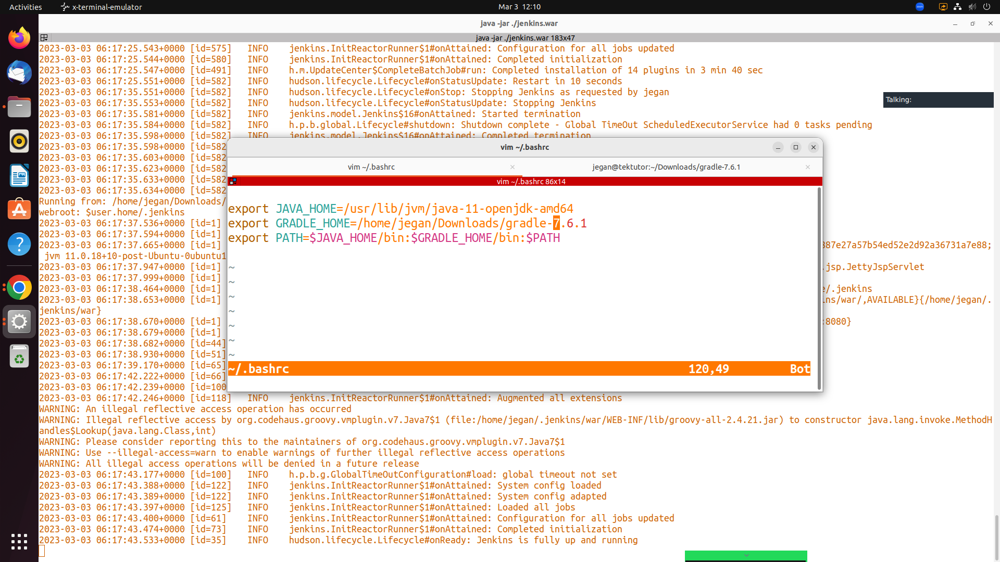

# Day 5 

## Install JDK 11
```
sudo apt install openjdk-11-jdk -y
```
Expected output
<pre>
jegan@tektutor.org  ~/Downloads $ <b>sudo apt install openjdk-11-jdk -y</b>
[sudo] password for jegan: 
Reading package lists... Done
Building dependency tree... Done
Reading state information... Done
The following additional packages will be installed:
  ca-certificates-java fonts-dejavu-extra java-common
  libatk-wrapper-java libatk-wrapper-java-jni libice-dev
  libpthread-stubs0-dev libsm-dev libx11-dev libxau-dev libxcb1-dev
  libxdmcp-dev libxt-dev openjdk-11-jdk-headless openjdk-11-jre
  openjdk-11-jre-headless x11proto-dev xorg-sgml-doctools xtrans-dev
Suggested packages:
  default-jre libice-doc libsm-doc libx11-doc libxcb-doc libxt-doc
  openjdk-11-demo openjdk-11-source visualvm fonts-ipafont-gothic
  fonts-ipafont-mincho fonts-wqy-microhei | fonts-wqy-zenhei
The following NEW packages will be installed:
  ca-certificates-java fonts-dejavu-extra java-common
  libatk-wrapper-java libatk-wrapper-java-jni libice-dev
  libpthread-stubs0-dev libsm-dev libx11-dev libxau-dev libxcb1-dev
  libxdmcp-dev libxt-dev openjdk-11-jdk openjdk-11-jdk-headless
  openjdk-11-jre openjdk-11-jre-headless x11proto-dev
  xorg-sgml-doctools xtrans-dev
0 upgraded, 20 newly installed, 0 to remove and 47 not upgraded.
Need to get 262 MB of archives.
After this operation, 413 MB of additional disk space will be used.
Get:1 http://in.archive.ubuntu.com/ubuntu jammy/main amd64 java-common all 0.72build2 [6,782 B]
Get:2 http://in.archive.ubuntu.com/ubuntu jammy-updates/main amd64 openjdk-11-jre-headless amd64 11.0.18+10-0ubuntu1~22.04 [41.6 MB]
Get:3 http://in.archive.ubuntu.com/ubuntu jammy-updates/main amd64 ca-certificates-java all 20190909ubuntu1.1 [12.0 kB]
Get:4 http://in.archive.ubuntu.com/ubuntu jammy/main amd64 fonts-dejavu-extra all 2.37-2build1 [2,041 kB]
Get:5 http://in.archive.ubuntu.com/ubuntu jammy/main amd64 libatk-wrapper-java all 0.38.0-5build1 [53.1 kB]
Get:6 http://in.archive.ubuntu.com/ubuntu jammy/main amd64 libatk-wrapper-java-jni amd64 0.38.0-5build1 [49.0 kB]
Get:7 http://in.archive.ubuntu.com/ubuntu jammy/main amd64 xorg-sgml-doctools all 1:1.11-1.1 [10.9 kB]
Get:8 http://in.archive.ubuntu.com/ubuntu jammy/main amd64 x11proto-dev all 2021.5-1 [604 kB]
Get:9 http://in.archive.ubuntu.com/ubuntu jammy/main amd64 libice-dev amd64 2:1.0.10-1build2 [51.4 kB]
Get:10 http://in.archive.ubuntu.com/ubuntu jammy/main amd64 libpthread-stubs0-dev amd64 0.4-1build2 [5,516 B]
Get:11 http://in.archive.ubuntu.com/ubuntu jammy/main amd64 libsm-dev amd64 2:1.2.3-1build2 [18.1 kB]
Get:12 http://in.archive.ubuntu.com/ubuntu jammy/main amd64 libxau-dev amd64 1:1.0.9-1build5 [9,724 B]
Get:13 http://in.archive.ubuntu.com/ubuntu jammy/main amd64 libxdmcp-dev amd64 1:1.1.3-0ubuntu5 [26.5 kB]
Get:14 http://in.archive.ubuntu.com/ubuntu jammy/main amd64 xtrans-dev all 1.4.0-1 [68.9 kB]
Get:15 http://in.archive.ubuntu.com/ubuntu jammy/main amd64 libxcb1-dev amd64 1.14-3ubuntu3 [86.5 kB]
Get:16 http://in.archive.ubuntu.com/ubuntu jammy/main amd64 libx11-dev amd64 2:1.7.5-1 [744 kB]
Get:17 http://in.archive.ubuntu.com/ubuntu jammy/main amd64 libxt-dev amd64 1:1.2.1-1 [396 kB]
Get:18 http://in.archive.ubuntu.com/ubuntu jammy-updates/main amd64 openjdk-11-jre amd64 11.0.18+10-0ubuntu1~22.04 [193 kB]
Get:19 http://in.archive.ubuntu.com/ubuntu jammy-updates/main amd64 openjdk-11-jdk-headless amd64 11.0.18+10-0ubuntu1~22.04 [214 MB]
Get:20 http://in.archive.ubuntu.com/ubuntu jammy-updates/main amd64 openjdk-11-jdk amd64 11.0.18+10-0ubuntu1~22.04 [1,564 kB]
Fetched 262 MB in 28s (9,299 kB/s)                                     
Selecting previously unselected package java-common.
(Reading database ... 251579 files and directories currently installed.)
Preparing to unpack .../00-java-common_0.72build2_all.deb ...
Unpacking java-common (0.72build2) ...
Selecting previously unselected package openjdk-11-jre-headless:amd64.
Preparing to unpack .../01-openjdk-11-jre-headless_11.0.18+10-0ubuntu1~2
2.04_amd64.deb ...
Unpacking openjdk-11-jre-headless:amd64 (11.0.18+10-0ubuntu1~22.04) ...
Selecting previously unselected package ca-certificates-java.
Preparing to unpack .../02-ca-certificates-java_20190909ubuntu1.1_all.de
b ...
Unpacking ca-certificates-java (20190909ubuntu1.1) ...
Selecting previously unselected package fonts-dejavu-extra.
Preparing to unpack .../03-fonts-dejavu-extra_2.37-2build1_all.deb ...
Unpacking fonts-dejavu-extra (2.37-2build1) ...
Selecting previously unselected package libatk-wrapper-java.
Preparing to unpack .../04-libatk-wrapper-java_0.38.0-5build1_all.deb ..
.
Unpacking libatk-wrapper-java (0.38.0-5build1) ...
Selecting previously unselected package libatk-wrapper-java-jni:amd64.
Preparing to unpack .../05-libatk-wrapper-java-jni_0.38.0-5build1_amd64.
deb ...
Unpacking libatk-wrapper-java-jni:amd64 (0.38.0-5build1) ...
Selecting previously unselected package xorg-sgml-doctools.
Preparing to unpack .../06-xorg-sgml-doctools_1%3a1.11-1.1_all.deb ...
Unpacking xorg-sgml-doctools (1:1.11-1.1) ...
Selecting previously unselected package x11proto-dev.
Preparing to unpack .../07-x11proto-dev_2021.5-1_all.deb ...
Unpacking x11proto-dev (2021.5-1) ...
Selecting previously unselected package libice-dev:amd64.
Preparing to unpack .../08-libice-dev_2%3a1.0.10-1build2_amd64.deb ...
Unpacking libice-dev:amd64 (2:1.0.10-1build2) ...
Selecting previously unselected package libpthread-stubs0-dev:amd64.
Preparing to unpack .../09-libpthread-stubs0-dev_0.4-1build2_amd64.deb .
..
Unpacking libpthread-stubs0-dev:amd64 (0.4-1build2) ...
Selecting previously unselected package libsm-dev:amd64.
Preparing to unpack .../10-libsm-dev_2%3a1.2.3-1build2_amd64.deb ...
Unpacking libsm-dev:amd64 (2:1.2.3-1build2) ...
Selecting previously unselected package libxau-dev:amd64.
Preparing to unpack .../11-libxau-dev_1%3a1.0.9-1build5_amd64.deb ...
Unpacking libxau-dev:amd64 (1:1.0.9-1build5) ...
Selecting previously unselected package libxdmcp-dev:amd64.
Preparing to unpack .../12-libxdmcp-dev_1%3a1.1.3-0ubuntu5_amd64.deb ...
Unpacking libxdmcp-dev:amd64 (1:1.1.3-0ubuntu5) ...
Selecting previously unselected package xtrans-dev.
Preparing to unpack .../13-xtrans-dev_1.4.0-1_all.deb ...
Unpacking xtrans-dev (1.4.0-1) ...
Selecting previously unselected package libxcb1-dev:amd64.
Preparing to unpack .../14-libxcb1-dev_1.14-3ubuntu3_amd64.deb ...
Unpacking libxcb1-dev:amd64 (1.14-3ubuntu3) ...
Selecting previously unselected package libx11-dev:amd64.
Preparing to unpack .../15-libx11-dev_2%3a1.7.5-1_amd64.deb ...
Unpacking libx11-dev:amd64 (2:1.7.5-1) ...
Selecting previously unselected package libxt-dev:amd64.
Preparing to unpack .../16-libxt-dev_1%3a1.2.1-1_amd64.deb ...
Unpacking libxt-dev:amd64 (1:1.2.1-1) ...
Selecting previously unselected package openjdk-11-jre:amd64.
Preparing to unpack .../17-openjdk-11-jre_11.0.18+10-0ubuntu1~22.04_amd6
4.deb ...
Unpacking openjdk-11-jre:amd64 (11.0.18+10-0ubuntu1~22.04) ...
Selecting previously unselected package openjdk-11-jdk-headless:amd64.
Preparing to unpack .../18-openjdk-11-jdk-headless_11.0.18+10-0ubuntu1~2
2.04_amd64.deb ...
Unpacking openjdk-11-jdk-headless:amd64 (11.0.18+10-0ubuntu1~22.04) ...
Selecting previously unselected package openjdk-11-jdk:amd64.
Preparing to unpack .../19-openjdk-11-jdk_11.0.18+10-0ubuntu1~22.04_amd6
4.deb ...
Unpacking openjdk-11-jdk:amd64 (11.0.18+10-0ubuntu1~22.04) ...
Setting up java-common (0.72build2) ...
Setting up libpthread-stubs0-dev:amd64 (0.4-1build2) ...
Setting up xtrans-dev (1.4.0-1) ...
Setting up fonts-dejavu-extra (2.37-2build1) ...
Setting up xorg-sgml-doctools (1:1.11-1.1) ...
Setting up libatk-wrapper-java (0.38.0-5build1) ...
Setting up libatk-wrapper-java-jni:amd64 (0.38.0-5build1) ...
Setting up openjdk-11-jre-headless:amd64 (11.0.18+10-0ubuntu1~22.04) ...
update-alternatives: using /usr/lib/jvm/java-11-openjdk-amd64/bin/java t
o provide /usr/bin/java (java) in auto mode
update-alternatives: using /usr/lib/jvm/java-11-openjdk-amd64/bin/jjs to
 provide /usr/bin/jjs (jjs) in auto mode
update-alternatives: using /usr/lib/jvm/java-11-openjdk-amd64/bin/keytoo
l to provide /usr/bin/keytool (keytool) in auto mode
update-alternatives: using /usr/lib/jvm/java-11-openjdk-amd64/bin/rmid t
o provide /usr/bin/rmid (rmid) in auto mode
update-alternatives: using /usr/lib/jvm/java-11-openjdk-amd64/bin/rmireg
istry to provide /usr/bin/rmiregistry (rmiregistry) in auto mode
update-alternatives: using /usr/lib/jvm/java-11-openjdk-amd64/bin/pack20
0 to provide /usr/bin/pack200 (pack200) in auto mode
update-alternatives: using /usr/lib/jvm/java-11-openjdk-amd64/bin/unpack
200 to provide /usr/bin/unpack200 (unpack200) in auto mode
update-alternatives: using /usr/lib/jvm/java-11-openjdk-amd64/lib/jexec 
to provide /usr/bin/jexec (jexec) in auto mode
Setting up openjdk-11-jre:amd64 (11.0.18+10-0ubuntu1~22.04) ...
Setting up openjdk-11-jdk-headless:amd64 (11.0.18+10-0ubuntu1~22.04) ...
update-alternatives: using /usr/lib/jvm/java-11-openjdk-amd64/bin/jar to
 provide /usr/bin/jar (jar) in auto mode
update-alternatives: using /usr/lib/jvm/java-11-openjdk-amd64/bin/jarsig
ner to provide /usr/bin/jarsigner (jarsigner) in auto mode
update-alternatives: using /usr/lib/jvm/java-11-openjdk-amd64/bin/javac 
to provide /usr/bin/javac (javac) in auto mode
update-alternatives: using /usr/lib/jvm/java-11-openjdk-amd64/bin/javado
c to provide /usr/bin/javadoc (javadoc) in auto mode
update-alternatives: using /usr/lib/jvm/java-11-openjdk-amd64/bin/javap 
to provide /usr/bin/javap (javap) in auto mode
update-alternatives: using /usr/lib/jvm/java-11-openjdk-amd64/bin/jcmd t
o provide /usr/bin/jcmd (jcmd) in auto mode
update-alternatives: using /usr/lib/jvm/java-11-openjdk-amd64/bin/jdb to
 provide /usr/bin/jdb (jdb) in auto mode
update-alternatives: using /usr/lib/jvm/java-11-openjdk-amd64/bin/jdeprs
can to provide /usr/bin/jdeprscan (jdeprscan) in auto mode
update-alternatives: using /usr/lib/jvm/java-11-openjdk-amd64/bin/jdeps 
to provide /usr/bin/jdeps (jdeps) in auto mode
update-alternatives: using /usr/lib/jvm/java-11-openjdk-amd64/bin/jfr to
 provide /usr/bin/jfr (jfr) in auto mode
update-alternatives: using /usr/lib/jvm/java-11-openjdk-amd64/bin/jimage
 to provide /usr/bin/jimage (jimage) in auto mode
update-alternatives: using /usr/lib/jvm/java-11-openjdk-amd64/bin/jinfo 
to provide /usr/bin/jinfo (jinfo) in auto mode
update-alternatives: using /usr/lib/jvm/java-11-openjdk-amd64/bin/jlink 
to provide /usr/bin/jlink (jlink) in auto mode
update-alternatives: using /usr/lib/jvm/java-11-openjdk-amd64/bin/jmap t
o provide /usr/bin/jmap (jmap) in auto mode
update-alternatives: using /usr/lib/jvm/java-11-openjdk-amd64/bin/jmod t
o provide /usr/bin/jmod (jmod) in auto mode
update-alternatives: using /usr/lib/jvm/java-11-openjdk-amd64/bin/jps to
 provide /usr/bin/jps (jps) in auto mode
update-alternatives: using /usr/lib/jvm/java-11-openjdk-amd64/bin/jrunsc
ript to provide /usr/bin/jrunscript (jrunscript) in auto mode
update-alternatives: using /usr/lib/jvm/java-11-openjdk-amd64/bin/jshell
 to provide /usr/bin/jshell (jshell) in auto mode
update-alternatives: using /usr/lib/jvm/java-11-openjdk-amd64/bin/jstack
 to provide /usr/bin/jstack (jstack) in auto mode
update-alternatives: using /usr/lib/jvm/java-11-openjdk-amd64/bin/jstat 
to provide /usr/bin/jstat (jstat) in auto mode
update-alternatives: using /usr/lib/jvm/java-11-openjdk-amd64/bin/jstatd
 to provide /usr/bin/jstatd (jstatd) in auto mode
update-alternatives: using /usr/lib/jvm/java-11-openjdk-amd64/bin/rmic t
o provide /usr/bin/rmic (rmic) in auto mode
update-alternatives: using /usr/lib/jvm/java-11-openjdk-amd64/bin/serial
ver to provide /usr/bin/serialver (serialver) in auto mode
update-alternatives: using /usr/lib/jvm/java-11-openjdk-amd64/bin/jaotc 
to provide /usr/bin/jaotc (jaotc) in auto mode
update-alternatives: using /usr/lib/jvm/java-11-openjdk-amd64/bin/jhsdb 
to provide /usr/bin/jhsdb (jhsdb) in auto mode
Setting up openjdk-11-jdk:amd64 (11.0.18+10-0ubuntu1~22.04) ...
update-alternatives: using /usr/lib/jvm/java-11-openjdk-amd64/bin/jconso
le to provide /usr/bin/jconsole (jconsole) in auto mode
Setting up ca-certificates-java (20190909ubuntu1.1) ...
head: cannot open '/etc/ssl/certs/java/cacerts' for reading: No such fil
e or directory
Adding debian:Buypass_Class_2_Root_CA.pem
Adding debian:Microsoft_RSA_Root_Certificate_Authority_2017.pem
Adding debian:DigiCert_Global_Root_G3.pem
Adding debian:GDCA_TrustAUTH_R5_ROOT.pem
Adding debian:Microsoft_ECC_Root_Certificate_Authority_2017.pem
Adding debian:GlobalSign_ECC_Root_CA_-_R5.pem
Adding debian:Entrust.net_Premium_2048_Secure_Server_CA.pem
Adding debian:GlobalSign_Root_CA_-_R3.pem
Adding debian:GLOBALTRUST_2020.pem
Adding debian:Go_Daddy_Class_2_CA.pem
Adding debian:Amazon_Root_CA_2.pem
Adding debian:Certum_Trusted_Network_CA_2.pem
Adding debian:SecureTrust_CA.pem
Adding debian:Cybertrust_Global_Root.pem
Adding debian:CFCA_EV_ROOT.pem
Adding debian:COMODO_ECC_Certification_Authority.pem
Adding debian:Certigna.pem
Adding debian:Certum_Trusted_Root_CA.pem
Adding debian:Starfield_Root_Certificate_Authority_-_G2.pem
Adding debian:Trustwave_Global_ECC_P384_Certification_Authority.pem
Adding debian:TWCA_Global_Root_CA.pem
Adding debian:AffirmTrust_Premium.pem
Adding debian:SwissSign_Silver_CA_-_G2.pem
Adding debian:Actalis_Authentication_Root_CA.pem
Adding debian:QuoVadis_Root_CA_3_G3.pem
Adding debian:Izenpe.com.pem
Adding debian:AC_RAIZ_FNMT-RCM_SERVIDORES_SEGUROS.pem
Adding debian:D-TRUST_Root_Class_3_CA_2_EV_2009.pem
Adding debian:AffirmTrust_Commercial.pem
Adding debian:E-Tugra_Certification_Authority.pem
Adding debian:QuoVadis_Root_CA_1_G3.pem
Adding debian:GlobalSign_Root_CA_-_R6.pem
Adding debian:GlobalSign_Root_CA_-_R2.pem
Adding debian:ePKI_Root_Certification_Authority.pem
Adding debian:SwissSign_Gold_CA_-_G2.pem
Adding debian:COMODO_Certification_Authority.pem
Adding debian:Starfield_Class_2_CA.pem
Adding debian:Security_Communication_RootCA2.pem
Adding debian:emSign_Root_CA_-_G1.pem
Adding debian:ISRG_Root_X1.pem
Adding debian:USERTrust_ECC_Certification_Authority.pem
Adding debian:COMODO_RSA_Certification_Authority.pem
Adding debian:DigiCert_Global_Root_G2.pem
Adding debian:Amazon_Root_CA_3.pem
Adding debian:Hellenic_Academic_and_Research_Institutions_RootCA_2011.pe
m
Adding debian:IdenTrust_Commercial_Root_CA_1.pem
Adding debian:Entrust_Root_Certification_Authority_-_G4.pem
Adding debian:DigiCert_High_Assurance_EV_Root_CA.pem
Adding debian:DigiCert_Assured_ID_Root_CA.pem
Adding debian:OISTE_WISeKey_Global_Root_GB_CA.pem
Adding debian:Microsec_e-Szigno_Root_CA_2009.pem
Adding debian:OISTE_WISeKey_Global_Root_GC_CA.pem
Adding debian:NetLock_Arany_=Class_Gold=_Főtanúsítvány.pem
Adding debian:QuoVadis_Root_CA_3.pem
Adding debian:AC_RAIZ_FNMT-RCM.pem
Adding debian:USERTrust_RSA_Certification_Authority.pem
Adding debian:GlobalSign_Root_E46.pem
Adding debian:Entrust_Root_Certification_Authority_-_G2.pem
Adding debian:Entrust_Root_Certification_Authority_-_EC1.pem
Adding debian:emSign_ECC_Root_CA_-_G3.pem
Adding debian:Trustwave_Global_Certification_Authority.pem
Adding debian:SecureSign_RootCA11.pem
Adding debian:Hellenic_Academic_and_Research_Institutions_ECC_RootCA_201
5.pem
Adding debian:Hongkong_Post_Root_CA_1.pem
Adding debian:AffirmTrust_Networking.pem
Adding debian:NAVER_Global_Root_Certification_Authority.pem
Adding debian:Amazon_Root_CA_1.pem
Adding debian:Certigna_Root_CA.pem
Adding debian:TeliaSonera_Root_CA_v1.pem
Adding debian:TUBITAK_Kamu_SM_SSL_Kok_Sertifikasi_-_Surum_1.pem
Adding debian:Starfield_Services_Root_Certificate_Authority_-_G2.pem
Adding debian:XRamp_Global_CA_Root.pem
Adding debian:CA_Disig_Root_R2.pem
Adding debian:DigiCert_Trusted_Root_G4.pem
Adding debian:ACCVRAIZ1.pem
Adding debian:Certum_EC-384_CA.pem
Adding debian:ssl-cert-snakeoil.pem
Adding debian:Baltimore_CyberTrust_Root.pem
Adding debian:UCA_Global_G2_Root.pem
Adding debian:QuoVadis_Root_CA_2.pem
Adding debian:GTS_Root_R3.pem
Adding debian:SSL.com_EV_Root_Certification_Authority_ECC.pem
Adding debian:D-TRUST_Root_Class_3_CA_2_2009.pem
Adding debian:Amazon_Root_CA_4.pem
Adding debian:SSL.com_Root_Certification_Authority_RSA.pem
Adding debian:QuoVadis_Root_CA_2_G3.pem
Adding debian:Buypass_Class_3_Root_CA.pem
Adding debian:Autoridad_de_Certificacion_Firmaprofesional_CIF_A62634068.
pem
Adding debian:Staat_der_Nederlanden_EV_Root_CA.pem
Adding debian:GlobalSign_Root_R46.pem
Adding debian:e-Szigno_Root_CA_2017.pem
Adding debian:T-TeleSec_GlobalRoot_Class_3.pem
Adding debian:ANF_Secure_Server_Root_CA.pem
Adding debian:Entrust_Root_Certification_Authority.pem
Adding debian:Secure_Global_CA.pem
Adding debian:Certum_Trusted_Network_CA.pem
Adding debian:Network_Solutions_Certificate_Authority.pem
Adding debian:AffirmTrust_Premium_ECC.pem
Adding debian:UCA_Extended_Validation_Root.pem
Adding debian:certSIGN_ROOT_CA.pem
Adding debian:Hellenic_Academic_and_Research_Institutions_RootCA_2015.pe
m
Adding debian:Security_Communication_Root_CA.pem
Adding debian:emSign_Root_CA_-_C1.pem
Adding debian:SSL.com_EV_Root_Certification_Authority_RSA_R2.pem
Adding debian:EC-ACC.pem
Adding debian:T-TeleSec_GlobalRoot_Class_2.pem
Adding debian:TWCA_Root_Certification_Authority.pem
Adding debian:Trustwave_Global_ECC_P256_Certification_Authority.pem
Adding debian:GlobalSign_ECC_Root_CA_-_R4.pem
Adding debian:certSIGN_Root_CA_G2.pem
Adding debian:GTS_Root_R1.pem
Adding debian:GTS_Root_R4.pem
Adding debian:emSign_ECC_Root_CA_-_C3.pem
Adding debian:SSL.com_Root_Certification_Authority_ECC.pem
Adding debian:Hongkong_Post_Root_CA_3.pem
Adding debian:Atos_TrustedRoot_2011.pem
Adding debian:DigiCert_Assured_ID_Root_G2.pem
Adding debian:Comodo_AAA_Services_root.pem
Adding debian:DigiCert_Global_Root_CA.pem
Adding debian:IdenTrust_Public_Sector_Root_CA_1.pem
Adding debian:DigiCert_Assured_ID_Root_G3.pem
Adding debian:GlobalSign_Root_CA.pem
Adding debian:Go_Daddy_Root_Certificate_Authority_-_G2.pem
Adding debian:SZAFIR_ROOT_CA2.pem
Adding debian:GTS_Root_R2.pem
done.
Processing triggers for mailcap (3.70+nmu1ubuntu1) ...
Processing triggers for fontconfig (2.13.1-4.2ubuntu5) ...
Processing triggers for desktop-file-utils (0.26-1ubuntu3) ...
Processing triggers for hicolor-icon-theme (0.17-2) ...
Processing triggers for gnome-menus (3.36.0-1ubuntu3) ...
Processing triggers for man-db (2.10.2-1) ...
Processing triggers for ca-certificates (20211016ubuntu0.22.04.1) ...
Updating certificates in /etc/ssl/certs...
0 added, 0 removed; done.
Running hooks in /etc/ca-certificates/update.d...

done.
done.
Processing triggers for sgml-base (1.30) ...
Setting up x11proto-dev (2021.5-1) ...
Setting up libxau-dev:amd64 (1:1.0.9-1build5) ...
Setting up libice-dev:amd64 (2:1.0.10-1build2) ...
Setting up libsm-dev:amd64 (2:1.2.3-1build2) ...
Setting up libxdmcp-dev:amd64 (1:1.1.3-0ubuntu5) ...
Setting up libxcb1-dev:amd64 (1.14-3ubuntu3) ...
Setting up libx11-dev:amd64 (2:1.7.5-1) ...
Setting up libxt-dev:amd64 (1:1.2.1-1) ...

jegan@tektutor.org  ~/Downloads $ <b>javac -version</b>
javac 11.0.18

jegan@tektutor.org  ~/Downloads $ <b>java -version</b> 
openjdk version "11.0.18" 2023-01-17
OpenJDK Runtime Environment (build 11.0.18+10-post-Ubuntu-0ubuntu122.04)
OpenJDK 64-Bit Server VM (build 11.0.18+10-post-Ubuntu-0ubuntu122.04, mixed mode, sharing)
</pre>


## Setup Jenkins CI Build Server
```
cd ~/Downloads
wget https://get.jenkins.io/war-stable/2.375.3/jenkins.war
java -jar ./jenkins.war
```

Expected output
<pre>
jegan@tektutor.org  ~/Downloads $ <b>java -jar ./jenkins.war</b>

Running from: /home/jegan/Downloads/jenkins.war
webroot: $user.home/.jenkins
2023-03-03 05:32:29.635+0000 [id=1]	INFO	winstone.Logger#logInternal: Beginning extraction from war file
2023-03-03 05:32:30.617+0000 [id=1]	WARNING	o.e.j.s.handler.ContextHandler#setContextPath: Empty contextPath
2023-03-03 05:32:30.678+0000 [id=1]	INFO	org.eclipse.jetty.server.Server#doStart: jetty-10.0.12; built: 2022-09-14T01:54:40.076Z; git: 408d0139887e27a57b54ed52e2d92a36731a7e88; jvm 11.0.18+10-post-Ubuntu-0ubuntu122.04
2023-03-03 05:32:30.951+0000 [id=1]	INFO	o.e.j.w.StandardDescriptorProcessor#visitServlet: NO JSP Support for /, did not find org.eclipse.jetty.jsp.JettyJspServlet
2023-03-03 05:32:31.001+0000 [id=1]	INFO	o.e.j.s.s.DefaultSessionIdManager#doStart: Session workerName=node0
2023-03-03 05:32:31.461+0000 [id=1]	INFO	hudson.WebAppMain#contextInitialized: Jenkins home directory: /home/jegan/.jenkins found at: $user.home/.jenkins
2023-03-03 05:32:31.644+0000 [id=1]	INFO	o.e.j.s.handler.ContextHandler#doStart: Started w.@681adc8f{Jenkins v2.375.3,/,file:///home/jegan/.jenkins/war/,AVAILABLE}{/home/jegan/.jenkins/war}
2023-03-03 05:32:31.702+0000 [id=1]	INFO	o.e.j.server.AbstractConnector#doStart: Started ServerConnector@6c0d7c83{HTTP/1.1, (http/1.1)}{0.0.0.0:8080}
2023-03-03 05:32:31.749+0000 [id=1]	INFO	org.eclipse.jetty.server.Server#doStart: Started Server@345f69f3{STARTING}[10.0.12,sto=0] @2548ms
2023-03-03 05:32:31.755+0000 [id=45]	INFO	winstone.Logger#logInternal: Winstone Servlet Engine running: controlPort=disabled
2023-03-03 05:32:31.967+0000 [id=51]	INFO	jenkins.InitReactorRunner$1#onAttained: Started initialization
2023-03-03 05:32:31.980+0000 [id=71]	INFO	jenkins.InitReactorRunner$1#onAttained: Listed all plugins
2023-03-03 05:32:32.694+0000 [id=79]	INFO	jenkins.InitReactorRunner$1#onAttained: Prepared all plugins
2023-03-03 05:32:32.707+0000 [id=88]	INFO	jenkins.InitReactorRunner$1#onAttained: Started all plugins
2023-03-03 05:32:32.722+0000 [id=96]	INFO	jenkins.InitReactorRunner$1#onAttained: Augmented all extensions
2023-03-03 05:32:32.930+0000 [id=116]	INFO	jenkins.InitReactorRunner$1#onAttained: System config loaded
2023-03-03 05:32:32.932+0000 [id=120]	INFO	jenkins.InitReactorRunner$1#onAttained: System config adapted
2023-03-03 05:32:32.933+0000 [id=125]	INFO	jenkins.InitReactorRunner$1#onAttained: Loaded all jobs
2023-03-03 05:32:32.936+0000 [id=132]	INFO	jenkins.InitReactorRunner$1#onAttained: Configuration for all jobs updated
2023-03-03 05:32:32.969+0000 [id=151]	INFO	hudson.util.Retrier#start: Attempt #1 to do the action check updates server
WARNING: An illegal reflective access operation has occurred
WARNING: Illegal reflective access by org.codehaus.groovy.vmplugin.v7.Java7$1 (file:/home/jegan/.jenkins/war/WEB-INF/lib/groovy-all-2.4.21.jar) to constructor java.lang.invoke.MethodHandles$Lookup(java.lang.Class,int)
WARNING: Please consider reporting this to the maintainers of org.codehaus.groovy.vmplugin.v7.Java7$1
WARNING: Use --illegal-access=warn to enable warnings of further illegal reflective access operations
WARNING: All illegal access operations will be denied in a future release
2023-03-03 05:32:33.335+0000 [id=139]	INFO	jenkins.install.SetupWizard#init: 

*************************************************************
*************************************************************
*************************************************************

Jenkins initial setup is required. An admin user has been created and a password generated.
Please use the following password to proceed to installation:

a857e5bec77d448c9ac393dfbef25659

This may also be found at: /home/jegan/.jenkins/secrets/initialAdminPassword

*************************************************************
*************************************************************
*************************************************************

2023-03-03 05:32:48.329+0000 [id=156]	INFO	jenkins.InitReactorRunner$1#onAttained: Completed initialization
2023-03-03 05:32:48.365+0000 [id=35]	INFO	hudson.lifecycle.Lifecycle#onReady: <b>Jenkins is fully up and running</b>
2023-03-03 05:32:49.383+0000 [id=151]	INFO	h.m.DownloadService$Downloadable#load: Obtained the updated data file for hudson.tasks.Maven.MavenInstaller
2023-03-03 05:32:49.385+0000 [id=151]	INFO	hudson.util.Retrier#start: Performed the action check updates server successfully at the attempt #1
</pre>

#### Accessing Jenkins Dashboard from your RPS Chrome web browser
<pre>
http://localhost:8080
</pre>

Expected output


#### Install Suggested Plugins


#### Create user


Click on Install without Restart


#### Installing Gradle in Linux
```
cd ~/Downloads
wget https://services.gradle.org/distributions/gradle-7.6.1-bin.zip
unzip gradle-7.6.1-bin.zip
```

Expected output
<pre>
jegan@tektutor.org  ~/Downloads $ <b>wget https://services.gradle.org/distributions/gradle-7.6.1-bin.zip</b>
--2023-03-03 12:02:33--  https://services.gradle.org/distributions/gradle-7.6.1-bin.zip
Resolving services.gradle.org (services.gradle.org)... 104.17.10.66, 104.17.46.54, 2606:4700::6811:2e36, ...
Connecting to services.gradle.org (services.gradle.org)|104.17.10.66|:443... connected.
HTTP request sent, awaiting response... 301 Moved Permanently
Location: https://downloads.gradle-dn.com/distributions/gradle-7.6.1-bin.zip [following]
--2023-03-03 12:02:33--  https://downloads.gradle-dn.com/distributions/gradle-7.6.1-bin.zip
Resolving downloads.gradle-dn.com (downloads.gradle-dn.com)... 104.17.140.32, 104.17.139.32, 2606:4700::6811:8b20, ...
Connecting to downloads.gradle-dn.com (downloads.gradle-dn.com)|104.17.140.32|:443... connected.
HTTP request sent, awaiting response... 200 OK
Length: 122052640 (116M) [application/zip]
Saving to: ‘gradle-7.6.1-bin.zip’

gradle-7.6.1-bin.zip               100%[================================================================>] 116.40M  24.1MB/s    in 4.9s    

2023-03-03 12:02:38 (23.8 MB/s) - ‘gradle-7.6.1-bin.zip’ saved [122052640/122052640]

 jegan@tektutor.org  ~/Downloads $ <b>ls</b>
'17763.3650.221105-1748.rs5_release_svc_refresh_SERVER_EVAL_x64FRE_en-us (1).iso'   CentOS-7-x86_64-DVD-2009.iso   jenkins.war
 awx.yml                                                                            gradle-7.6.1-bin.zip
 jegan@tektutor.org  ~/Downloads $ <b>unzip gradle-7.6.1-bin.zip</b>
Archive:  gradle-7.6.1-bin.zip
   creating: gradle-7.6.1/
  inflating: gradle-7.6.1/LICENSE    
  inflating: gradle-7.6.1/NOTICE     
  inflating: gradle-7.6.1/README     
   creating: gradle-7.6.1/init.d/
  inflating: gradle-7.6.1/init.d/readme.txt  
   creating: gradle-7.6.1/bin/
  inflating: gradle-7.6.1/bin/gradle  
  inflating: gradle-7.6.1/bin/gradle.bat  
   creating: gradle-7.6.1/lib/
  inflating: gradle-7.6.1/lib/gradle-runtime-api-info-7.6.1.jar  
  inflating: gradle-7.6.1/lib/gradle-installation-beacon-7.6.1.jar  
  inflating: gradle-7.6.1/lib/gradle-api-metadata-7.6.1.jar  
  inflating: gradle-7.6.1/lib/gradle-launcher-7.6.1.jar  
  inflating: gradle-7.6.1/lib/gradle-kotlin-dsl-7.6.1.jar  
  inflating: gradle-7.6.1/lib/gradle-build-events-7.6.1.jar  
  inflating: gradle-7.6.1/lib/gradle-tooling-api-7.6.1.jar  
  inflating: gradle-7.6.1/lib/gradle-core-7.6.1.jar  
  inflating: gradle-7.6.1/lib/gradle-jvm-services-7.6.1.jar  
  inflating: gradle-7.6.1/lib/gradle-file-collections-7.6.1.jar  
  inflating: gradle-7.6.1/lib/gradle-execution-7.6.1.jar  
  inflating: gradle-7.6.1/lib/gradle-model-groovy-7.6.1.jar  
  inflating: gradle-7.6.1/lib/gradle-model-core-7.6.1.jar  
  inflating: gradle-7.6.1/lib/gradle-build-cache-7.6.1.jar  
  inflating: gradle-7.6.1/lib/gradle-core-api-7.6.1.jar  
  inflating: gradle-7.6.1/lib/gradle-persistent-cache-7.6.1.jar  
  inflating: gradle-7.6.1/lib/gradle-resources-7.6.1.jar  
  inflating: gradle-7.6.1/lib/gradle-worker-processes-7.6.1.jar  
  inflating: gradle-7.6.1/lib/gradle-logging-7.6.1.jar  
  inflating: gradle-7.6.1/lib/groovy-ant-3.0.13.jar  
  inflating: gradle-7.6.1/lib/ant-junit-1.10.12.jar  
  inflating: gradle-7.6.1/lib/ant-1.10.11.jar  
  inflating: gradle-7.6.1/lib/ant-launcher-1.10.11.jar  
  inflating: gradle-7.6.1/lib/gradle-process-services-7.6.1.jar  
  inflating: gradle-7.6.1/lib/gradle-messaging-7.6.1.jar  
  inflating: gradle-7.6.1/lib/gradle-build-option-7.6.1.jar  
  inflating: gradle-7.6.1/lib/gradle-native-7.6.1.jar  
  inflating: gradle-7.6.1/lib/gradle-base-services-groovy-7.6.1.jar  
  inflating: gradle-7.6.1/lib/gradle-file-temp-7.6.1.jar  
  inflating: gradle-7.6.1/lib/gradle-base-services-7.6.1.jar  
  inflating: gradle-7.6.1/lib/gradle-normalization-java-7.6.1.jar  
  inflating: gradle-7.6.1/lib/asm-commons-9.3.jar  
  inflating: gradle-7.6.1/lib/asm-analysis-9.3.jar  
  inflating: gradle-7.6.1/lib/asm-tree-9.3.jar  
  inflating: gradle-7.6.1/lib/asm-9.3.jar  
  inflating: gradle-7.6.1/lib/gradle-build-cache-packaging-7.6.1.jar  
  inflating: gradle-7.6.1/lib/commons-compress-1.21.jar  
  inflating: gradle-7.6.1/lib/commons-io-2.11.0.jar  
  inflating: gradle-7.6.1/lib/commons-lang-2.6.jar  
  inflating: gradle-7.6.1/lib/fastutil-8.5.2-min.jar  
  inflating: gradle-7.6.1/lib/gradle-file-watching-7.6.1.jar  
  inflating: gradle-7.6.1/lib/gradle-snapshots-7.6.1.jar  
  inflating: gradle-7.6.1/lib/gradle-build-cache-base-7.6.1.jar  
  inflating: gradle-7.6.1/lib/gradle-files-7.6.1.jar  
  inflating: gradle-7.6.1/lib/gradle-hashing-7.6.1.jar  
  inflating: gradle-7.6.1/lib/guava-31.1-jre.jar  
  inflating: gradle-7.6.1/lib/groovy-json-3.0.13.jar  
  inflating: gradle-7.6.1/lib/groovy-astbuilder-3.0.13.jar  
  inflating: gradle-7.6.1/lib/groovy-console-3.0.13.jar  
  inflating: gradle-7.6.1/lib/groovy-dateutil-3.0.13.jar  
  inflating: gradle-7.6.1/lib/groovy-datetime-3.0.13.jar  
  inflating: gradle-7.6.1/lib/groovy-groovydoc-3.0.13.jar  
  inflating: gradle-7.6.1/lib/groovy-nio-3.0.13.jar  
  inflating: gradle-7.6.1/lib/groovy-sql-3.0.13.jar  
  inflating: gradle-7.6.1/lib/groovy-docgenerator-3.0.13.jar  
  inflating: gradle-7.6.1/lib/groovy-templates-3.0.13.jar  
  inflating: gradle-7.6.1/lib/groovy-test-3.0.13.jar  
  inflating: gradle-7.6.1/lib/groovy-xml-3.0.13.jar  
  inflating: gradle-7.6.1/lib/groovy-swing-3.0.13.jar  
  inflating: gradle-7.6.1/lib/groovy-3.0.13.jar  
  inflating: gradle-7.6.1/lib/junit-4.13.2.jar  
  inflating: gradle-7.6.1/lib/hamcrest-core-1.3.jar  
  inflating: gradle-7.6.1/lib/javax.inject-1.jar  
  inflating: gradle-7.6.1/lib/jansi-1.18.jar  
  inflating: gradle-7.6.1/lib/jcl-over-slf4j-1.7.30.jar  
  inflating: gradle-7.6.1/lib/kotlin-stdlib-jdk8-1.7.10.jar  
  inflating: gradle-7.6.1/lib/kotlin-compiler-embeddable-1.7.10.jar  
  inflating: gradle-7.6.1/lib/kotlin-stdlib-jdk7-1.7.10.jar  
  inflating: gradle-7.6.1/lib/kotlin-reflect-1.7.10.jar  
  inflating: gradle-7.6.1/lib/kotlin-stdlib-1.7.10.jar  
  inflating: gradle-7.6.1/lib/annotations-20.1.0.jar  
  inflating: gradle-7.6.1/lib/gradle-enterprise-operations-7.6.1.jar  
  inflating: gradle-7.6.1/lib/gradle-functional-7.6.1.jar  
  inflating: gradle-7.6.1/lib/gradle-bootstrap-7.6.1.jar  
  inflating: gradle-7.6.1/lib/gradle-problems-7.6.1.jar  
  inflating: gradle-7.6.1/lib/gradle-kotlin-dsl-tooling-models-7.6.1.jar  
  inflating: gradle-7.6.1/lib/gradle-worker-services-7.6.1.jar  
  inflating: gradle-7.6.1/lib/gradle-enterprise-logging-7.6.1.jar  
  inflating: gradle-7.6.1/lib/gradle-build-operations-7.6.1.jar  
  inflating: gradle-7.6.1/lib/gradle-enterprise-workers-7.6.1.jar  
  inflating: gradle-7.6.1/lib/gradle-logging-api-7.6.1.jar  
  inflating: gradle-7.6.1/lib/gradle-base-annotations-7.6.1.jar  
  inflating: gradle-7.6.1/lib/tomlj-1.0.0.jar  
  inflating: gradle-7.6.1/lib/jsr305-3.0.2.jar  
  inflating: gradle-7.6.1/lib/jul-to-slf4j-1.7.30.jar  
  inflating: gradle-7.6.1/lib/kryo-2.24.0.jar  
  inflating: gradle-7.6.1/lib/log4j-over-slf4j-1.7.30.jar  
  inflating: gradle-7.6.1/lib/minlog-1.2.jar  
  inflating: gradle-7.6.1/lib/native-platform-0.22-milestone-24.jar  
  inflating: gradle-7.6.1/lib/file-events-0.22-milestone-24.jar  
  inflating: gradle-7.6.1/lib/objenesis-2.6.jar  
  inflating: gradle-7.6.1/lib/slf4j-api-1.7.30.jar  
  inflating: gradle-7.6.1/lib/trove4j-1.0.20200330.jar  
  inflating: gradle-7.6.1/lib/jna-5.10.0.jar  
  inflating: gradle-7.6.1/lib/xml-apis-1.4.01.jar  
  inflating: gradle-7.6.1/lib/javaparser-core-3.17.0.jar  
  inflating: gradle-7.6.1/lib/gradle-cli-7.6.1.jar  
  inflating: gradle-7.6.1/lib/gradle-wrapper-shared-7.6.1.jar  
  inflating: gradle-7.6.1/lib/kotlin-script-runtime-1.7.10.jar  
  inflating: gradle-7.6.1/lib/kotlin-daemon-embeddable-1.7.10.jar  
  inflating: gradle-7.6.1/lib/kotlin-scripting-common-1.7.10.jar  
  inflating: gradle-7.6.1/lib/kotlin-scripting-jvm-1.7.10.jar  
  inflating: gradle-7.6.1/lib/kotlin-scripting-jvm-host-1.7.10.jar  
  inflating: gradle-7.6.1/lib/kotlin-scripting-compiler-embeddable-1.7.10.jar  
  inflating: gradle-7.6.1/lib/kotlin-scripting-compiler-impl-embeddable-1.7.10.jar  
  inflating: gradle-7.6.1/lib/kotlin-sam-with-receiver-compiler-plugin-1.7.10.jar  
  inflating: gradle-7.6.1/lib/kotlinx-metadata-jvm-0.5.0.jar  
  inflating: gradle-7.6.1/lib/failureaccess-1.0.1.jar  
  inflating: gradle-7.6.1/lib/native-platform-freebsd-amd64-libcpp-0.22-milestone-24.jar  
  inflating: gradle-7.6.1/lib/native-platform-linux-aarch64-0.22-milestone-24.jar  
  inflating: gradle-7.6.1/lib/native-platform-linux-amd64-0.22-milestone-24.jar  
  inflating: gradle-7.6.1/lib/native-platform-osx-aarch64-0.22-milestone-24.jar  
  inflating: gradle-7.6.1/lib/native-platform-osx-amd64-0.22-milestone-24.jar  
  inflating: gradle-7.6.1/lib/native-platform-windows-amd64-0.22-milestone-24.jar  
  inflating: gradle-7.6.1/lib/native-platform-windows-amd64-min-0.22-milestone-24.jar  
  inflating: gradle-7.6.1/lib/native-platform-windows-i386-0.22-milestone-24.jar  
  inflating: gradle-7.6.1/lib/native-platform-windows-i386-min-0.22-milestone-24.jar  
  inflating: gradle-7.6.1/lib/native-platform-linux-aarch64-ncurses5-0.22-milestone-24.jar  
  inflating: gradle-7.6.1/lib/native-platform-linux-aarch64-ncurses6-0.22-milestone-24.jar  
  inflating: gradle-7.6.1/lib/native-platform-linux-amd64-ncurses5-0.22-milestone-24.jar  
  inflating: gradle-7.6.1/lib/native-platform-linux-amd64-ncurses6-0.22-milestone-24.jar  
  inflating: gradle-7.6.1/lib/file-events-linux-aarch64-0.22-milestone-24.jar  
  inflating: gradle-7.6.1/lib/file-events-linux-amd64-0.22-milestone-24.jar  
  inflating: gradle-7.6.1/lib/file-events-osx-aarch64-0.22-milestone-24.jar  
  inflating: gradle-7.6.1/lib/file-events-osx-amd64-0.22-milestone-24.jar  
  inflating: gradle-7.6.1/lib/file-events-windows-amd64-0.22-milestone-24.jar  
  inflating: gradle-7.6.1/lib/file-events-windows-amd64-min-0.22-milestone-24.jar  
  inflating: gradle-7.6.1/lib/file-events-windows-i386-0.22-milestone-24.jar  
  inflating: gradle-7.6.1/lib/file-events-windows-i386-min-0.22-milestone-24.jar  
  inflating: gradle-7.6.1/lib/ant-antlr-1.10.12.jar  
  inflating: gradle-7.6.1/lib/antlr4-runtime-4.7.2.jar  
  inflating: gradle-7.6.1/lib/kotlin-stdlib-common-1.7.10.jar  
  inflating: gradle-7.6.1/lib/qdox-1.12.1.jar  
   creating: gradle-7.6.1/lib/plugins/
  inflating: gradle-7.6.1/lib/plugins/gradle-kotlin-dsl-provider-plugins-7.6.1.jar  
  inflating: gradle-7.6.1/lib/plugins/gradle-plugin-development-7.6.1.jar  
  inflating: gradle-7.6.1/lib/plugins/gradle-build-init-7.6.1.jar  
  inflating: gradle-7.6.1/lib/plugins/gradle-build-profile-7.6.1.jar  
  inflating: gradle-7.6.1/lib/plugins/gradle-antlr-7.6.1.jar  
  inflating: gradle-7.6.1/lib/plugins/gradle-enterprise-7.6.1.jar  
  inflating: gradle-7.6.1/lib/plugins/gradle-configuration-cache-7.6.1.jar  
  inflating: gradle-7.6.1/lib/plugins/gradle-tooling-api-builders-7.6.1.jar  
  inflating: gradle-7.6.1/lib/plugins/gradle-kotlin-dsl-tooling-builders-7.6.1.jar  
  inflating: gradle-7.6.1/lib/plugins/gradle-testing-junit-platform-7.6.1.jar  
  inflating: gradle-7.6.1/lib/plugins/junit-platform-launcher-1.8.2.jar  
  inflating: gradle-7.6.1/lib/plugins/junit-platform-engine-1.8.2.jar  
  inflating: gradle-7.6.1/lib/plugins/junit-platform-commons-1.8.2.jar  
  inflating: gradle-7.6.1/lib/plugins/gradle-code-quality-7.6.1.jar  
  inflating: gradle-7.6.1/lib/plugins/gradle-signing-7.6.1.jar  
  inflating: gradle-7.6.1/lib/plugins/gradle-tooling-native-7.6.1.jar  
  inflating: gradle-7.6.1/lib/plugins/gradle-ide-native-7.6.1.jar  
  inflating: gradle-7.6.1/lib/plugins/gradle-ide-7.6.1.jar  
  inflating: gradle-7.6.1/lib/plugins/gradle-scala-7.6.1.jar  
  inflating: gradle-7.6.1/lib/plugins/gradle-ear-7.6.1.jar  
  inflating: gradle-7.6.1/lib/plugins/gradle-jacoco-7.6.1.jar  
  inflating: gradle-7.6.1/lib/plugins/gradle-testing-native-7.6.1.jar  
  inflating: gradle-7.6.1/lib/plugins/gradle-language-native-7.6.1.jar  
  inflating: gradle-7.6.1/lib/plugins/gradle-maven-7.6.1.jar  
  inflating: gradle-7.6.1/lib/plugins/gradle-ivy-7.6.1.jar  
  inflating: gradle-7.6.1/lib/plugins/gradle-plugins-7.6.1.jar  
  inflating: gradle-7.6.1/lib/plugins/gradle-testing-jvm-7.6.1.jar  
  inflating: gradle-7.6.1/lib/plugins/gradle-language-groovy-7.6.1.jar  
  inflating: gradle-7.6.1/lib/plugins/gradle-language-java-7.6.1.jar  
  inflating: gradle-7.6.1/lib/plugins/gradle-language-jvm-7.6.1.jar  
  inflating: gradle-7.6.1/lib/plugins/gradle-platform-jvm-7.6.1.jar  
  inflating: gradle-7.6.1/lib/plugins/gradle-composite-builds-7.6.1.jar  
  inflating: gradle-7.6.1/lib/plugins/gradle-plugin-use-7.6.1.jar  
  inflating: gradle-7.6.1/lib/plugins/gradle-publish-7.6.1.jar  
  inflating: gradle-7.6.1/lib/plugins/gradle-testing-base-7.6.1.jar  
  inflating: gradle-7.6.1/lib/plugins/gradle-platform-native-7.6.1.jar  
  inflating: gradle-7.6.1/lib/plugins/gradle-diagnostics-7.6.1.jar  
  inflating: gradle-7.6.1/lib/plugins/gradle-platform-base-7.6.1.jar  
  inflating: gradle-7.6.1/lib/plugins/gradle-version-control-7.6.1.jar  
  inflating: gradle-7.6.1/lib/plugins/gradle-dependency-management-7.6.1.jar  
  inflating: gradle-7.6.1/lib/plugins/gradle-reporting-7.6.1.jar  
  inflating: gradle-7.6.1/lib/plugins/gradle-workers-7.6.1.jar  
  inflating: gradle-7.6.1/lib/plugins/gradle-test-kit-7.6.1.jar  
  inflating: gradle-7.6.1/lib/plugins/gradle-resources-s3-7.6.1.jar  
  inflating: gradle-7.6.1/lib/plugins/gradle-resources-gcs-7.6.1.jar  
  inflating: gradle-7.6.1/lib/plugins/gradle-build-cache-http-7.6.1.jar  
  inflating: gradle-7.6.1/lib/plugins/gradle-security-7.6.1.jar  
  inflating: gradle-7.6.1/lib/plugins/gradle-resources-http-7.6.1.jar  
  inflating: gradle-7.6.1/lib/plugins/gradle-resources-sftp-7.6.1.jar  
  inflating: gradle-7.6.1/lib/plugins/aws-java-sdk-s3-1.11.948.jar  
  inflating: gradle-7.6.1/lib/plugins/aws-java-sdk-kms-1.11.948.jar  
  inflating: gradle-7.6.1/lib/plugins/aws-java-sdk-sts-1.11.948.jar  
  inflating: gradle-7.6.1/lib/plugins/aws-java-sdk-core-1.11.948.jar  
  inflating: gradle-7.6.1/lib/plugins/org.eclipse.jgit-5.7.0.202003110725-r.jar  
  inflating: gradle-7.6.1/lib/plugins/bcpg-jdk15on-1.68.jar  
  inflating: gradle-7.6.1/lib/plugins/bcpkix-jdk15on-1.68.jar  
  inflating: gradle-7.6.1/lib/plugins/bcprov-jdk15on-1.68.jar  
  inflating: gradle-7.6.1/lib/plugins/testng-6.3.1.jar  
  inflating: gradle-7.6.1/lib/plugins/bsh-2.0b6.jar  
  inflating: gradle-7.6.1/lib/plugins/capsule-0.6.3.jar  
  inflating: gradle-7.6.1/lib/plugins/google-api-services-storage-v1-rev20220705-1.32.1.jar  
  inflating: gradle-7.6.1/lib/plugins/google-api-client-1.34.0.jar  
  inflating: gradle-7.6.1/lib/plugins/google-http-client-apache-v2-1.42.2.jar  
  inflating: gradle-7.6.1/lib/plugins/google-oauth-client-1.34.1.jar  
  inflating: gradle-7.6.1/lib/plugins/google-http-client-gson-1.42.2.jar  
  inflating: gradle-7.6.1/lib/plugins/google-http-client-1.42.2.jar  
  inflating: gradle-7.6.1/lib/plugins/httpclient-4.5.13.jar  
  inflating: gradle-7.6.1/lib/plugins/commons-codec-1.15.jar  
  inflating: gradle-7.6.1/lib/plugins/opencensus-contrib-http-util-0.31.1.jar  
  inflating: gradle-7.6.1/lib/plugins/gson-2.8.9.jar  
  inflating: gradle-7.6.1/lib/plugins/httpcore-4.4.14.jar  
  inflating: gradle-7.6.1/lib/plugins/maven-settings-builder-3.6.3.jar  
  inflating: gradle-7.6.1/lib/plugins/ivy-2.3.0.jar  
  inflating: gradle-7.6.1/lib/plugins/jackson-core-2.13.3.jar  
  inflating: gradle-7.6.1/lib/plugins/jmespath-java-1.11.948.jar  
  inflating: gradle-7.6.1/lib/plugins/jackson-databind-2.13.3.jar  
  inflating: gradle-7.6.1/lib/plugins/jackson-annotations-2.13.3.jar  
  inflating: gradle-7.6.1/lib/plugins/jaxb-impl-3.0.0.jar  
  inflating: gradle-7.6.1/lib/plugins/jaxb-core-3.0.0.jar  
  inflating: gradle-7.6.1/lib/plugins/jakarta.xml.bind-api-3.0.0.jar  
  inflating: gradle-7.6.1/lib/plugins/jakarta.activation-2.0.0.jar  
  inflating: gradle-7.6.1/lib/plugins/jatl-0.2.3.jar  
  inflating: gradle-7.6.1/lib/plugins/jcifs-1.3.17.jar  
  inflating: gradle-7.6.1/lib/plugins/jcommander-1.78.jar  
  inflating: gradle-7.6.1/lib/plugins/joda-time-2.10.4.jar  
  inflating: gradle-7.6.1/lib/plugins/jsch-0.1.55.jar  
  inflating: gradle-7.6.1/lib/plugins/jsoup-1.15.1.jar  
  inflating: gradle-7.6.1/lib/plugins/jzlib-1.1.3.jar  
  inflating: gradle-7.6.1/lib/plugins/maven-builder-support-3.6.3.jar  
  inflating: gradle-7.6.1/lib/plugins/maven-model-3.6.3.jar  
  inflating: gradle-7.6.1/lib/plugins/maven-repository-metadata-3.6.3.jar  
  inflating: gradle-7.6.1/lib/plugins/maven-settings-3.6.3.jar  
  inflating: gradle-7.6.1/lib/plugins/plexus-sec-dispatcher-1.4.jar  
  inflating: gradle-7.6.1/lib/plugins/plexus-cipher-1.7.jar  
  inflating: gradle-7.6.1/lib/plugins/plexus-interpolation-1.26.jar  
  inflating: gradle-7.6.1/lib/plugins/plexus-utils-3.3.0.jar  
  inflating: gradle-7.6.1/lib/plugins/dd-plist-1.21.jar  
  inflating: gradle-7.6.1/lib/plugins/snakeyaml-1.32.jar  
  inflating: gradle-7.6.1/lib/plugins/gradle-wrapper-7.6.1.jar  
  inflating: gradle-7.6.1/lib/plugins/gradle-java-compiler-plugin-7.6.1.jar  
  inflating: gradle-7.6.1/lib/plugins/ion-java-1.0.2.jar  
  inflating: gradle-7.6.1/lib/plugins/opentest4j-1.2.0.jar  
  inflating: gradle-7.6.1/lib/plugins/opencensus-api-0.31.1.jar  
  inflating: gradle-7.6.1/lib/plugins/grpc-context-1.27.2.jar  
  
jegan@tektutor.org  ~/Downloads $ <b>cd gradle-7.6.1</b>
jegan@tektutor.org  ~/Downloads/gradle-7.6.1 $ <b>ls</b>
bin  init.d  lib  LICENSE  NOTICE  README
jegan@tektutor.org  ~/Downloads/gradle-7.6.1 $ <b>pwd</b>
<b>/home/jegan/Downloads/gradle-7.6.1</b>
</pre>

Similarly, find your JAVA Home folder
<pre>
jegan@tektutor.org  ~/Downloads/gradle-7.6.1 $ <b>which javac</b>
/usr/bin/javac

jegan@tektutor.org  ~/Downloads/gradle-7.6.1 $ <b>ls -l /usr/bin/javac</b>
lrwxrwxrwx 1 root root 23 Mar  3 11:00 /usr/bin/javac -> /etc/alternatives/javac

jegan@tektutor.org  ~/Downloads/gradle-7.6.1 $ <b>ls -l /etc/alternatives/javac</b>
lrwxrwxrwx 1 root root 44 Mar  3 11:00 /etc/alternatives/javac -> /usr/lib/jvm/java-11-openjdk-amd64/bin/javac
</pre>

### Exporting the JDK and Grade path to environment settings
Edit ~/.bashrc file and at the end of the file paste the below


In order to apply the ~/.bashrc changes, you need to source the ~/.bashrc as shown below
<pre>
jegan@tektutor.org:~/Downloads/gradle-7.6.1$ <b>source ~/.bashrc</b>
jegan@tektutor.org:~/Downloads/gradle-7.6.1$ <b>gradle --version</b>

Welcome to Gradle 7.6.1!

Here are the highlights of this release:
 - Added support for Java 19.
 - Introduced `--rerun` flag for individual task rerun.
 - Improved dependency block for test suites to be strongly typed.
 - Added a pluggable system for Java toolchains provisioning.

For more details see https://docs.gradle.org/7.6.1/release-notes.html


------------------------------------------------------------
Gradle 7.6.1
------------------------------------------------------------

Build time:   2023-02-24 13:54:42 UTC
Revision:     3905fe8ac072bbd925c70ddbddddf4463341f4b4

Kotlin:       1.7.10
Groovy:       3.0.13
Ant:          Apache Ant(TM) version 1.10.11 compiled on July 10 2021
JVM:          11.0.18 (Ubuntu 11.0.18+10-post-Ubuntu-0ubuntu122.04)
OS:           Linux 5.19.0-35-generic amd64
</pre>
